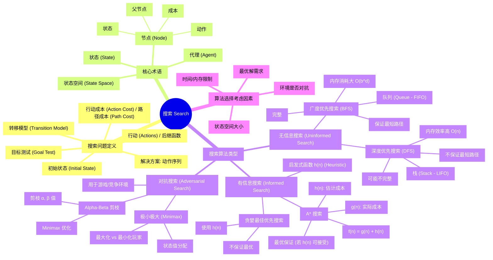

好的，这是根据您提供的文档内容总结的知识点以及使用 Mermaid 语法绘制的思维导图。

**知识点总结:**

1.  **搜索问题**: 人工智能中的基本问题，包含初始状态、目标测试、后继函数（返回可用动作）和行动成本。目标是找到从初始状态到目标状态的动作序列。
2.  **核心术语**:
    *   **代理 (Agent)**: 执行搜索的实体。
    *   **状态 (State)**: 环境的特定配置。
    *   **初始状态 (Initial State)**: 搜索的起点。
    *   **行动 (Actions)**: 在状态中可做的选择。
    *   **转移模型 (Transition Model)**: 描述动作如何改变状态。
    *   **状态空间 (State Space)**: 从初始状态可达的所有状态集合。
    *   **目标测试 (Goal Test)**: 判断当前状态是否为目标。
    *   **路径成本 (Path Cost)**: 到达某个状态的总成本。
    *   **节点 (Node)**: 数据结构，包含状态、父节点、动作和路径成本。
3.  **无信息搜索 (Uninformed/Blind Search)**: 不考虑目标位置。
    *   **深度优先搜索 (DFS)**: 使用栈 (LIFO)，深入探索路径，内存效率高，但不保证找到最短路径，可能不完整或陷入循环。
    *   **广度优先搜索 (BFS)**: 使用队列 (FIFO)，逐层探索，保证找到最短路径（若成本一致），内存消耗大，是完整的。
4.  **有信息搜索 (Informed Search)**: 使用启发式函数估计到目标的成本。
    *   **贪婪最佳优先搜索**: 扩展启发式评估最接近目标的节点，不保证最优。
    *   **A\* 搜索**: 结合实际成本 `g(n)` 和启发式成本 `h(n)`（`f(n) = g(n) + h(n)`），如果启发式函数 `h(n)` 是可接受的（不高于实际成本），则保证找到最优解。
5.  **对抗搜索 (Adversarial Search)**: 用于有对手的游戏环境。
    *   **极小极大 (Minimax)**: 用于双人零和博弈，一个玩家最大化得分，另一个最小化得分。
    *   **Alpha-Beta 剪枝**: Minimax 的优化，通过跟踪当前最佳选择（α 和 β 值），剪掉不可能影响最终结果的分支。
6.  **算法选择**: 取决于问题特性，如状态空间大小、是否需要最优解、时间和内存限制以及是否存在对抗性。

**思维导图 (Mermaid):**

