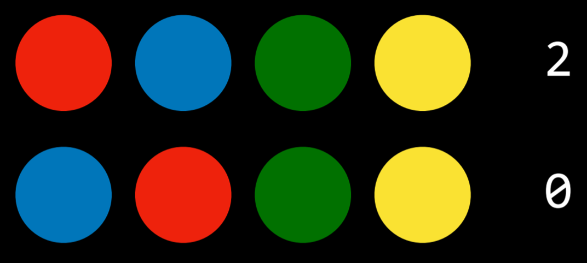
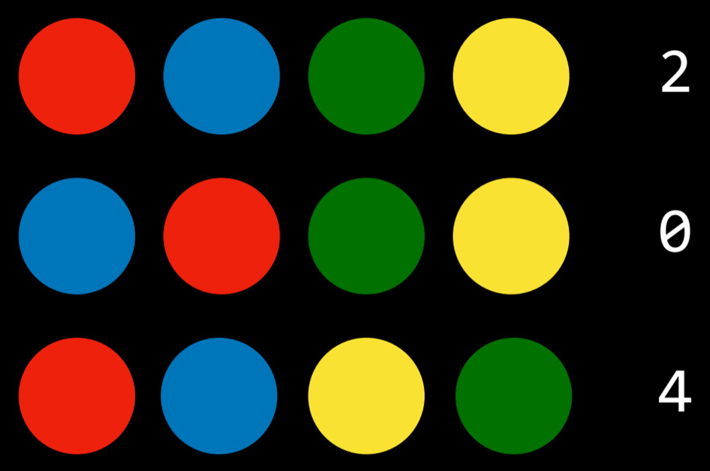

# 第 1 讲 - CS50's 人工智能导论与 Python

对[认证证书、专业证书或学分转换和认证](../../#how-to-take-this-course)感兴趣吗？

## 知识（Knowledge）

人类基于已有知识进行推理并得出结论。在人工智能中也使用了表示知识和从中得出结论的概念，本讲我们将探讨如何实现这种行为。

### 基于知识的智能体（Knowledge-Based Agents）

这些是通过对内部知识表示进行操作来进行推理的智能体。

什么是"基于知识推理以得出结论"？

让我们从一个哈利·波特的例子开始回答这个问题。考虑以下句子：

1.  如果没下雨，哈利今天拜访了海格。
2.  哈利今天拜访了海格或邓布利多，但不是两个人都拜访了。
3.  哈利今天拜访了邓布利多。

基于这三个句子，我们可以回答"今天下雨了吗？"这个问题，尽管没有任何一个句子直接告诉我们今天是否下雨。以下是我们的推理过程：看着第 3 句，我们知道哈利拜访了邓布利多。根据第 2 句，我们知道哈利要么拜访了邓布利多要么拜访了海格，因此我们可以得出结论：

4.  哈利没有拜访海格。

现在，看着第 1 句，我们知道如果没下雨，哈利会拜访海格。然而，根据第 4 句，我们知道事实并非如此。因此，我们可以得出结论：

5.  今天下雨了。

为了得出这个结论，我们使用了逻辑，今天的讲座探讨了人工智能如何使用逻辑基于现有信息得出新的结论。

### 句子（Sentence）

句子是在知识表示语言中关于世界的断言。句子是人工智能存储知识并用它来推断新信息的方式。

## 命题逻辑（Propositional Logic）

命题逻辑基于命题，即关于世界的可以为真或假的陈述，就像上面的句子 1-5。

### 命题符号（Propositional Symbols）

命题符号通常是用来表示命题的字母（P、Q、R）。

### 逻辑连接词（Logical Connectives）

逻辑连接词是连接命题符号的逻辑符号，用于对世界进行更复杂的推理。

- **非（¬）**：反转命题的真值。例如，如果 P 表示"在下雨"，那么 ¬P 表示"没有在下雨"。

  真值表用于比较所有可能的命题真值分配。这个工具将帮助我们更好地理解使用不同逻辑连接词时命题的真值。

- **与（∧）**：连接两个不同的命题。当这两个命题 P 和 Q 用 ∧ 连接时，结果命题 P ∧ Q 只有在 P 和 Q 都为真时才为真。

- **或（∨）**：只要其参数之一为真就为真。这意味着对于 P ∨ Q 为真，P 或 Q 中至少有一个必须为真。

  值得一提的是，有两种类型的或：包含性或和排他性或。在排他性或中，如果 P ∧ Q 为真，则 P ∨ Q 为假。也就是说，排他性或要求其参数中只有一个为真而不是两个都为真。包含性或在 P、Q 或 P ∧ Q 中的任何一个为真时为真。在或（∨）的情况下，指的是包含性或。

> **一些在讲座中未提到的附注**：
>
> - 有时一个例子有助于理解包含性与排他性或。包含性或："要想吃甜点，你必须打扫房间或修剪草坪。"在这种情况下，如果你做了两件事，你仍然可以得到饼干。排他性或："对于甜点，你可以要么吃饼干要么吃冰淇淋。"在这种情况下，你不能两个都吃。
> - 如果你好奇，排他性或通常缩写为 XOR，其常用符号是 ⊕。

- **蕴含（→）**：表示"如果 P 那么 Q"的结构。例如，如果 P："在下雨"且 Q："我在室内"，那么 P → Q 表示"如果在下雨，那么我在室内"。在 P 蕴含 Q（P → Q）的情况下，P 被称为**前件**，Q 被称为**后件**。

- **双条件（）**：是一个双向的蕴含。你可以理解为"当且仅当"。P  Q 相当于 P → Q 和 Q → P 的结合。

### 模型（Model）

模型是对每个命题的真值赋值。重申一下，命题是可以为真或假的关于世界的陈述。然而，关于世界的知识是通过这些命题的真值来表示的。模型就是提供关于世界信息的真值赋值。

例如，如果 P："在下雨。"且 Q："是星期二。"，一个模型可以是以下真值赋值：{P = True，Q = False}。这个模型意味着在下雨，但不是星期二。然而，在这种情况下还有更多可能的模型（例如，{P = True，Q = True}，表示既在下雨又是星期二）。实际上，可能的模型数量是 2 的命题数量次方。在这个例子中，我们有 2 个命题，所以 2²=4 种可能的模型。

### 知识库（Knowledge Base，KB）

知识库是基于知识的智能体已知的一组句子。这是以命题逻辑句子形式提供给人工智能的关于世界的知识，可以用来进行额外的推理。

### 蕴含（⊨）

如果 α ⊨ β（α 蕴含 β），那么在任何 α 为真的世界中，β 也为真。

例如，如果 α："这是一月份的星期二"且 β："这是一月份"，那么我们知道 α ⊨ β。如果说这是一月份的星期二是真的，我们也知道这是一月份。蕴含与表示逻辑连接词的蕴含（→）不同。蕴含（→）是两个命题之间的逻辑连接词。而蕴含（⊨）是一种关系，表示如果 α 中的所有信息都为真，那么 β 中的所有信息也为真。

## 推理（Inference）

推理是从旧句子推导出新句子的过程。

例如，在前面的哈利·波特例子中，第 4 句和第 5 句是从第 1、2、3 句推理得出的。

有多种方法可以基于现有知识推断新知识。首先，我们将考虑**模型检查**算法。

- 要确定 KB ⊨ α（换句话说，回答问题："我们能否基于我们的知识库得出 α 为真的结论"）
  - 列举所有可能的模型。
  - 如果在 KB 为真的每个模型中，α 也为真，那么 KB 蕴含 α（KB ⊨ α）。

考虑以下例子：

P：今天是星期二
Q：在下雨
R：哈利会去跑步
KB：(P ∧ ¬Q) → R（换句话说，P 和非 Q 蕴含 R）
P（P 为真）
¬Q（Q 为假）
查询：R（我们想知道 R 是真是假；KB ⊨ R？）

让我们看看如何使用 Python 代码表示知识和逻辑：

```python
from logic import *

# 创建新类，每个类都有一个名字或符号来表示每个命题
rain = Symbol("rain")  # 在下雨
hagrid = Symbol("hagrid")  # 哈利拜访了海格
dumbledore = Symbol("dumbledore")  # 哈利拜访了邓布利多

# 将句子保存到知识库中
knowledge = And(  # 从"与"逻辑连接词开始，因为每个命题代表我们知道为真的知识
    Implication(Not(rain), hagrid),  # ¬(在下雨) → (哈利拜访了海格)
    Or(hagrid, dumbledore),  # (哈利拜访了海格) ∨ (哈利拜访了邓布利多)
    Not(And(hagrid, dumbledore)),  # ¬(哈利拜访了海格 ∧ 哈利拜访了邓布利多)，即哈利没有同时拜访海格和邓布利多
    dumbledore  # 哈利拜访了邓布利多。注意，虽然前面的命题包含多个符号和连接词，这是一个由一个符号组成的命题。这意味着在这个知识库中，我们将哈利拜访了邓布利多作为一个事实。
)
```

要运行模型检查算法，需要以下信息：

- 知识库，将用于进行推理
- 查询，即我们感兴趣的是否被知识库蕴含的命题
- 符号，所使用的所有符号（或原子命题）的列表（在我们的例子中，这些是`rain`、`hagrid`和`dumbledore`）
- 模型，对符号的真假值赋值

模型检查算法如下所示：

```python
def check_all(knowledge, query, symbols, model):

    # 如果模型对每个符号都有赋值
    # （下面的逻辑可能有点令人困惑：我们从一个符号列表开始。这个函数是递归的，每次调用自身时都会从符号列表中弹出一个符号并从中生成模型。
    # 因此，当符号列表为空时，我们知道我们已经完成了生成具有所有可能真值赋值的模型。）
    if not symbols:

        # 如果知识库在模型中为真，那么查询也必须为真
        if knowledge.evaluate(model):
            return query.evaluate(model)
        return True
    else:

        # 选择剩余未使用符号中的一个
        remaining = symbols.copy()
        p = remaining.pop()

        # 创建符号为真的模型
        model_true = model.copy()
        model_true[p] = True

        # 创建符号为假的模型
        model_false = model.copy()
        model_false[p] = False

        # 确保蕴含在两个模型中都成立
        return(check_all(knowledge, query, remaining, model_true) and
               check_all(knowledge, query, remaining, model_false))
```

注意，我们只对 KB 为真的模型感兴趣。如果 KB 为假，那么我们知道为真的条件在这些模型中并未发生，使它们与我们的情况无关。

> **来自讲座外的一个例子**：设 P：哈利打击手，Q：奥利弗守门员，R：格兰芬多获胜。我们的 KB 指定 P Q (P ∧ Q) → R。换句话说，我们知道 P 为真，即哈利打击手，Q 为真，即奥利弗守门员，如果 P 和 Q 都为真，那么 R 也为真，意味着格兰芬多赢得比赛。现在想象一个哈利打击手而不是找球手的模型（因此，哈利不是打击手，¬P）。好吧，在这种情况下，我们不关心格兰芬多是否获胜（R 是否为真），因为我们在 KB 中有信息表明哈利打击手而不是找球手。我们只对 P 和 Q 为真的模型感兴趣。

## 知识工程（Knowledge Engineering）

知识工程是思考如何在人工智能中表示命题和逻辑的过程。

让我们使用游戏《线索》来练习知识工程。

在游戏中，凶手用一个**工具**在某个**地点**杀害了受害者。人物、工具和地点由卡片表示。每个类别随机选取一张卡片放入信封中，参与者需要揭示是谁干的。参与者通过发现卡片并从这些线索中推断出信封里有什么来做到这一点。我们将使用之前的模型检查算法来揭开谜底。在我们的模型中，我们将确定为真的项目标记为与谋杀有关，为假的则不相关。

例如，假设我们有三个人：Mustard、Plum 和 Scarlet，三个工具：小刀、左轮手枪和扳手，三个地点：舞厅、厨房和图书馆。

我们可以从添加游戏规则开始创建我们的知识库。我们确切地知道一个人是凶手，使用了一个工具，且谋杀发生在一个地点。这可以用命题逻辑表示如下：

(Mustard ∨ Plum ∨ Scarlet)

(knife ∨ revolver ∨ wrench)

(ballroom ∨ kitchen ∨ library)

游戏开始时，每个玩家看到一个人物、一个工具和一个地点，因此知道它们与谋杀无关。玩家不会分享他们在这些卡片中看到的信息。假设我们的玩家得到了 Mustard、厨房和左轮手枪的卡片。因此，我们知道这些与谋杀无关，我们可以添加到我们的 KB 中：

¬(Mustard)

¬(kitchen)

¬(revolver)

在游戏的其他情况下，一个人可以猜测，建议一个人物、工具和地点的组合。假设猜测是 Scarlet 用扳手在图书馆实施了犯罪。如果这个猜测是错的，那么可以推断并添加到 KB 中：

(¬Scarlet ∨ ¬library ∨ ¬wrench)

现在，假设有人给我们看了 Plum 卡片。因此，我们可以添加：

¬(Plum)

到我们的 KB 中。

在这一点上，我们可以得出结论，凶手是 Scarlet，因为必须是 Mustard、Plum 和 Scarlet 之一，而我们有证据表明前两者不是。

再添加一条知识，例如，不是在舞厅，可以给我们更多信息。首先，我们更新我们的 KB：

¬(ballroom)

现在，使用多个先前的数据，我们可以推断出 Scarlet 用小刀在图书馆实施了谋杀。我们可以推断出是在图书馆，因为必须是舞厅、厨房或图书馆之一，而前两个被证明不是地点。然而，当有人猜测 Scarlet、图书馆、扳手时，猜测是错误的。因此，这个陈述中的至少一个元素必须是假的。由于我们知道 Scarlet 和图书馆都是真的，我们知道扳手是这里的假部分。由于三种工具中必须有一个是真的，而不是扳手也不是左轮手枪，我们可以得出结论是小刀。

这里是如何将信息添加到 Python 中的知识库：

```python
# 将线索添加到KB
knowledge = And(
    # 首先是游戏条件：三个类别中的每一个都必须有一个项目为真
    Or(mustard, plum, scarlet),
    Or(ballroom, kitchen, library),
    Or(knife, revolver, wrench),

    # 添加我们看到的三张初始卡片的信息
    Not(mustard),
    Not(kitchen),
    Not(revolver),

    # 添加有人猜测是Scarlet用扳手在图书馆
    Or(Not(scarlet), Not(library), Not(wrench)),

    # 添加我们看到的卡片
    Not(plum),
    Not(ballroom)
)
```

我们可以看看其他逻辑谜题。考虑以下例子：四个不同的人，Gilderoy、Pomona、Minerva 和 Horace，被分配到四个不同的学院，格兰芬多、赫奇帕奇、拉文克劳和斯莱特林。每个学院恰好有一个人。用命题逻辑表示谜题的条件相当繁琐。首先，每个可能的分配本身都必须是一个命题：MinervaGryffindor（米勒娃在格兰芬多）、MinervaHufflepuff（米勒娃在赫奇帕奇）、MinervaRavenclaw（米勒娃在拉文克劳）、MinervaSlytherin（米勒娃在斯莱特林）、PomonaGryffindor（波莫娜在格兰芬多）……其次，为了表示每个人都属于一个学院，需要对每个人的所有可能学院分配使用"或"语句：

(MinervaGryffindor ∨ MinervaHufflepuff ∨ MinervaRavenclaw ∨ MinervaSlytherin)，对每个人重复。

然后，为了表示如果一个人被分配到一个学院，他们就不会被分配到其他学院，我们将写：

(MinervaGryffindor → ¬MinervaHufflepuff) ∧ (MinervaGryffindor → ¬MinervaRavenclaw) ∧ (MinervaGryffindor → ¬MinervaSlytherin) ∧ (MinervaHufflepuff → ¬MinervaGryffindor)……

对所有学院和所有人都如此。一阶逻辑部分提供了解决这种低效率的方案。然而，只要有足够的线索，这类谜题仍然可以用任一类型的逻辑来解决。

另一种可以用命题逻辑解决的谜题是"猜密码"（Mastermind）游戏。在这个游戏中，玩家一按特定顺序排列颜色，然后玩家二必须猜测这个顺序。每轮玩家二做一个猜测，玩家一给出一个数字，表示玩家二猜对了多少颜色的位置。让我们模拟一个有四种颜色的游戏。假设玩家二提出以下排序：


玩家一回答"两个"。因此我们知道有两种颜色位置正确，另外两种颜色位置错误。基于这个信息，玩家二尝试交换两种颜色的位置。



现在玩家一回答"零个"。因此，玩家二知道被交换的颜色最初位置是正确的，这意味着未动的两种颜色位置是错误的。玩家二交换它们。



玩家一说"四个"，游戏结束。

用命题逻辑表示这个问题需要我们有(颜色数量)² 个原子命题。所以，在四种颜色的情况下，我们会有命题 red0、red1、red2、red3、blue0……代表颜色和位置。下一步是用命题逻辑表示游戏规则（每个位置只有一种颜色，颜色不重复）并将它们添加到知识库（KB）。最后一步是将我们拥有的所有线索添加到知识库中。在我们的例子中，我们会添加第一次猜测中有两个位置错误、两个位置正确，第二次猜测中没有正确的信息。使用这些知识，模型检查算法可以给我们谜题的解决方案。

模型检查不是一个高效的算法，因为它必须在给出答案之前考虑每个可能的模型（提醒：如果在 KB 为真的所有模型（真值赋值）下，查询 R 也为真，那么查询 R 为真）。推理规则允许我们在不考虑每个可能模型的情况下基于现有知识生成新信息。

推理规则通常用一条水平线表示，将上部分（前提）与下部分（结论）分开。前提是我们拥有的任何知识，结论是基于前提可以生成的知识。

在这个例子中，我们的前提包含以下命题：

- 如果哈利在下雨，那么哈利在室内。
- 在下雨。

基于这一点，大多数合理的人可以得出结论：

- 哈利在室内。

### Modus Ponens（假言推理）

我们在这个例子中使用的推理规则类型是 Modus Ponens，这是一个花哨的说法，表示如果我们知道一个蕴含及其前件为真，那么后件也为真。

### And Elimination（与消除）

如果一个 And 命题为真，那么其中的任何一个原子命题也为真。例如，如果我们知道哈利和罗恩和赫敏是朋友，我们可以得出结论哈利和赫敏是朋友。

### Double Negation Elimination（双重否定消除）

一个被否定两次的命题为真。例如，考虑命题"哈利没有不及格"。我们可以这样解析："不是真的（哈利不及格）"，或者"¬(哈利不及格)"，最后"¬(¬(哈利及格))"。两个否定相互抵消，将命题"哈利及格"标记为真。

### Implication Elimination（蕴含消除）

一个蕴含等价于被否定的前件与后件之间的 Or 关系。例如，命题"如果在下雨，哈利在室内"等价于命题"（没有在下雨）或（哈利在室内）"。

这个可能有点令人困惑。然而，考虑以下真值表：

由于 P → Q 和 ¬P ∨ Q 具有相同的真值赋值，我们知道它们在逻辑上是等价的。另一种思考方式是，一个蕴含在两种可能条件之一满足时为真：首先，如果前件为假，蕴含是显然真的（如前面在蕴含部分讨论的）。这由 ¬P ∨ Q 中的否定前件 P 表示，意味着如果 P 为假，命题总是真的。其次，蕴含仅在前件为真且后件也为真时为真。也就是说，如果 P 和 Q 都为真，那么 ¬P ∨ Q 为真。然而，如果 P 为真而 Q 不是，那么 ¬P ∨ Q 为假。

### Biconditional Elimination（双条件消除）

一个双条件命题等价于一个蕴含及其逆命题与一个 And 连接词。例如，"当且仅当在下雨时哈利在室内"等价于（"如果在下雨，哈利在室内"且"如果哈利在室内，在下雨"）。

### De Morgan's Law（德·摩根定律）

可以将 And 连接词转换为 Or 连接词。考虑以下命题："哈利和罗恩都没有通过考试是不真的"。从这一点，我们可以得出结论"哈利没有通过考试是不真的"或"罗恩没有通过考试是不真的"。也就是说，为了使前面的 And 命题为真，Or 命题中的至少一个命题必须为真。

类似地，我们可以得出相反的结论。考虑命题"哈利或罗恩通过考试是不真的"。这可以改写为"哈利没有通过考试"且"罗恩没有通过考试"。

### Distributive Property（分配律）

一个具有两个由 And 或 Or 连接词分组的元素的命题可以分配或分解成由 And 和 Or 组成的更小的单位。

### 知识和搜索问题

推理可以被视为具有以下属性的搜索问题：

- 初始状态：起始知识库
- 行动：推理规则
- 转移模型：推理后的新知识库
- 目标测试：检查我们试图证明的语句是否在 KB 中
- 路径成本函数：证明中的步骤数

这表明搜索算法是多么多样化，允许我们使用推理规则基于现有知识推导新信息。

## 归结（Resolution）

归结是一个强大的推理规则，它指出如果 Or 命题中的两个原子命题之一为假，另一个必须为真。例如，给定命题"罗恩在大厅里"或"赫敏在图书馆里"，加上命题"罗恩不在大厅里"，我们可以得出结论"赫敏在图书馆里"。更正式地，我们可以这样定义归结：

归结依赖于**互补文字**，即两个相同的原子命题，其中一个被否定而另一个没有，比如 P 和 ¬P。

归结可以进一步推广。假设除了命题"罗恩在大厅里"或"赫敏在图书馆里"外，我们还知道"罗恩不在大厅里"或"哈利在睡觉"。我们可以从这些信息中通过归结推断出"赫敏在图书馆里"或"哈利在睡觉"。用正式术语来说：

互补文字允许我们通过归结推理生成新的句子。因此，推理算法通过定位互补文字来生成新知识。

**子句（Clause）**是文字的析取（命题符号或命题符号的否定，如 P，¬P）。一个**析取（disjunction）**由用 Or 逻辑连接词连接的命题组成（P ∨ Q ∨ R）。相反，一个**合取（conjunction）**由用 And 逻辑连接词连接的命题组成（P ∧ Q ∧ R）。子句允许我们将任何逻辑语句转换为**合取范式（Conjunctive Normal Form，CNF）**，即子句的合取，例如：(A ∨ B ∨ C) ∧ (D ∨ ¬E) ∧ (F ∨ G)。

**将命题转换为合取范式的步骤**

- 消除双条件
  - 将(α  β)转换为(α → β) ∧ (β → α)
- 消除蕴含
  - 将(α → β)转换为 ¬α ∨ β
- 使用德·摩根定律将否定向内移动，直到只否定文字（而不是子句）
  - 将 ¬(α ∧ β)转换为 ¬α ∨ ¬β

这里是一个将(P ∨ Q) → R 转换为合取范式的例子：

- (P ∨ Q) → R
- ¬(P ∨ Q) ∨ R /消除蕴含
- (¬P ∧ ¬Q) ∨ R /德·摩根定律
- (¬P ∨ R) ∧ (¬Q ∨ R) /分配律

在这一点上，我们可以在合取范式上运行推理算法。有时，通过归结推理的过程，我们可能会遇到一个子句包含相同文字两次的情况。在这些情况下，使用一个称为**因子化（factoring）**的过程，其中重复的文字被删除。例如，(P ∨ Q ∨ S) ∧ (¬P ∨ R ∨ S)通过归结允许我们推断(Q ∨ S ∨ R ∨ S)。重复的 S 可以被删除得到(Q ∨ R ∨ S)。

解析一个文字及其否定，即 ¬P 和 P，得到**空子句**()。空子句始终为假，这是有道理的，因为 P 和 ¬P 不可能同时为真。归结算法使用了这个事实。

- 要确定 KB ⊨ α：
  - 检查：(KB ∧ ¬α)是否是一个矛盾？
    - 如果是，那么 KB ⊨ α
    - 否则，没有蕴含

矛盾证明是计算机科学中经常使用的工具。如果我们的知识库为真，并且它与 ¬α 矛盾，这意味着 ¬α 为假，因此，α 必须为真。更技术性地说，算法将执行以下操作：

- 要确定 KB ⊨ α：
  - 将(KB ∧ ¬α)转换为合取范式
  - 不断检查看是否可以使用归结生成新的子句
  - 如果我们产生了空子句（等价于 False），恭喜！我们已经得到了矛盾，从而证明了 KB ⊨ α
  - 然而，如果没有达到矛盾且不能推断更多子句，就没有蕴含

这里是一个说明这个算法如何工作的例子：

- (A ∨ B) ∧ (¬B ∨ C) ∧ (¬C)是否蕴含 A？
- 首先，为了通过矛盾证明，我们假设 A 为假。因此，我们得到(A ∨ B) ∧ (¬B ∨ C) ∧ (¬C) ∧ (¬A)
- 现在，我们可以开始生成新信息。由于我们知道 C 为假（¬C），唯一使（¬B ∨ C）为真的方式是 B 也为假。因此，我们可以将（¬B）添加到我们的 KB 中。
- 接下来，因为我们知道（¬B），唯一使（A ∨ B）为真的方式是 A 为真。因此，我们可以将（A）添加到我们的 KB 中。
- 现在我们的 KB 有两个互补文字，（A）和（¬A）。我们将它们归结，得到空集（）。空集根据定义为假，所以我们已经得到了矛盾。

## 一阶逻辑（First Order Logic）

一阶逻辑是另一种逻辑，它允许我们比命题逻辑更简洁地表达更复杂的想法。一阶逻辑使用两种类型的符号：**常量符号**和**谓词符号**。常量符号代表对象，而谓词符号就像关系或函数，接受一个参数并返回真或假值。

例如，我们回到霍格沃茨不同人物和学院分配的逻辑谜题。常量符号是人物或学院，如米勒娃、波莫娜、格兰芬多、赫奇帕奇等。谓词符号是对某些常量符号成立或不成立的属性。例如，我们可以使用句子 Person(Minerva)来表达米勒娃是一个人的想法。同样，我们可以使用句子 House(Gryffindor)来表达格兰芬多是一个学院的想法。所有逻辑连接词在一阶逻辑中的工作方式与之前相同。例如，¬House(Minerva)表达米勒娃不是学院的想法。一个谓词符号也可以接受两个或更多参数并表达它们之间的关系。例如，BelongsTo 表达了两个参数之间的关系，即人物和该人物所属的学院。因此，米勒娃属于格兰芬多的想法可以表达为 BelongsTo(Minerva, Gryffindor)。一阶逻辑允许为每个人物和每个学院各有一个符号。这比命题逻辑更简洁，在命题逻辑中，每个人物-学院分配都需要一个不同的符号。

### 全称量化（Universal Quantification）

量化是可以在一阶逻辑中使用的工具，用来表示不使用特定常量符号的句子。全称量化使用符号 ∀ 来表示"对所有"。因此，例如，句子 ∀x. BelongsTo(x, Gryffindor) → ¬BelongsTo(x, Hufflepuff)表达了对每个符号都成立的想法：如果这个符号属于格兰芬多，它就不属于赫奇帕奇。

### 存在量化（Existential Quantification）

存在量化是与全称量化平行的概念。然而，虽然全称量化用于创建对所有 x 都成立的句子，但存在量化用于创建对至少一个 x 成立的句子。它使用符号 ∃ 表示。例如，句子 ∃x. House(x) ∧ BelongsTo(Minerva, x)意味着至少存在一个既是学院又是米勒娃所属的符号。换句话说，这表达了米勒娃属于一个学院的想法。

存在和全称量化可以在同一个句子中使用。例如，句子 ∀x. Person(x) → (∃y. House(y) ∧ BelongsTo(x, y))表达了如果 x 是一个人，那么至少存在一个学院 y，这个人属于该学院。换句话说，这个句子意味着每个人都属于一个学院。

还有其他类型的逻辑，它们的共同点是都致力于表示信息。这些是我们用来在人工智能中表示知识的系统。
