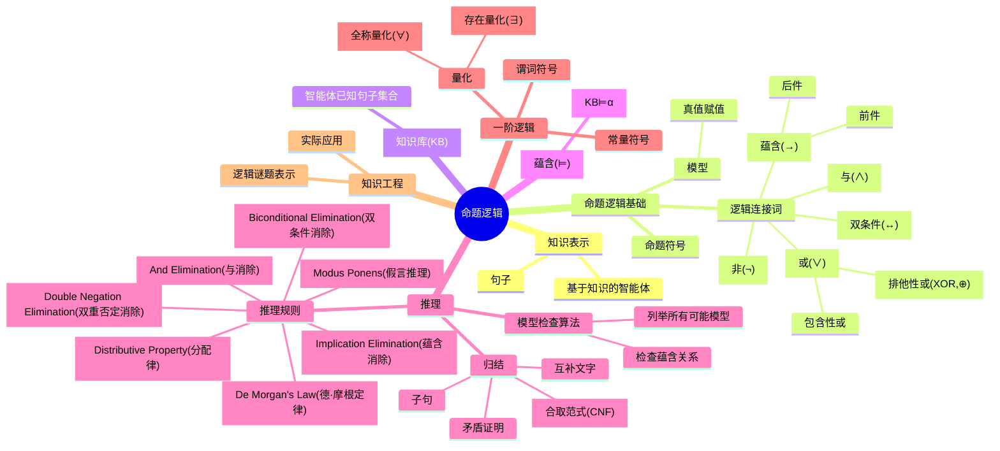

# 命题逻辑与推理知识总结

## 核心概念

命题逻辑是人工智能中表示知识和进行推理的基础工具，它使智能体能够基于已有知识得出新的结论。

### 基本元素

- **命题**：可以为真或假的关于世界的陈述
- **知识库(KB)**：智能体已知的句子集合
- **模型**：对每个命题的真值赋值，可能模型数量为2^n(n为命题数)
- **蕴含(⊨)**：若α⊨β，则α为真的所有世界中β也为真

### 逻辑连接词

- **非(¬)**：反转命题真值
- **与(∧)**：两命题都为真时结果为真
- **或(∨)**：
  - 包含性或：至少一个命题为真时结果为真
  - 排他性或(XOR,⊕)：有且仅有一个命题为真时结果为真
- **蕴含(→)**："如果P那么Q"，仅在前件为真而后件为假时结果为假
- **双条件(↔)**：双向蕴含，"当且仅当"，等价于P→Q和Q→P的结合

### 推理方法

- **模型检查**：检查KB为真的所有模型中α是否也为真
- **推理规则**：如Modus Ponens、And Elimination等
- **归结**：通过互补文字推导出新句子，可用于矛盾证明
- **一阶逻辑**：比命题逻辑更强大，引入常量符号、谓词符号和量化器

## 思维导图

这个思维导图展示了命题逻辑中的核心概念及其关系，从基础的命题表示到复杂的推理规则和一阶逻辑。命题逻辑为AI提供了表示知识和进行推理的框架，使机器能够基于已有信息得出新的结论。