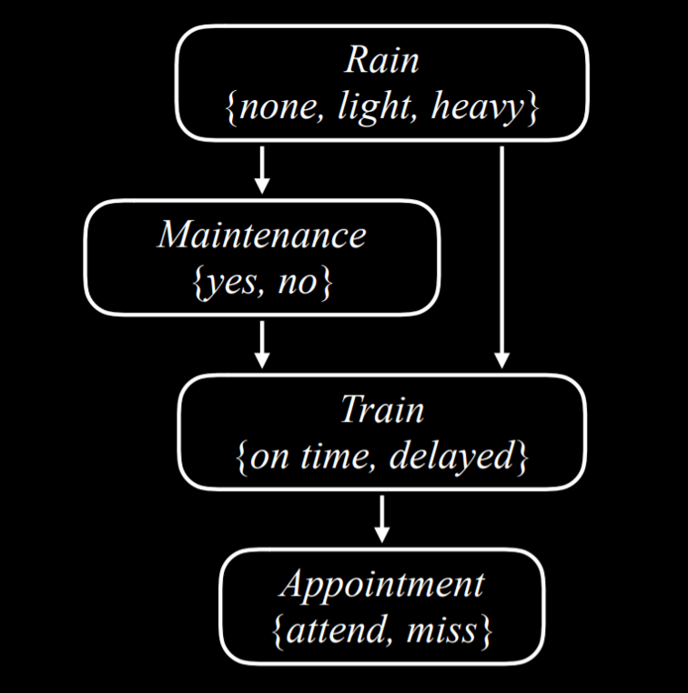
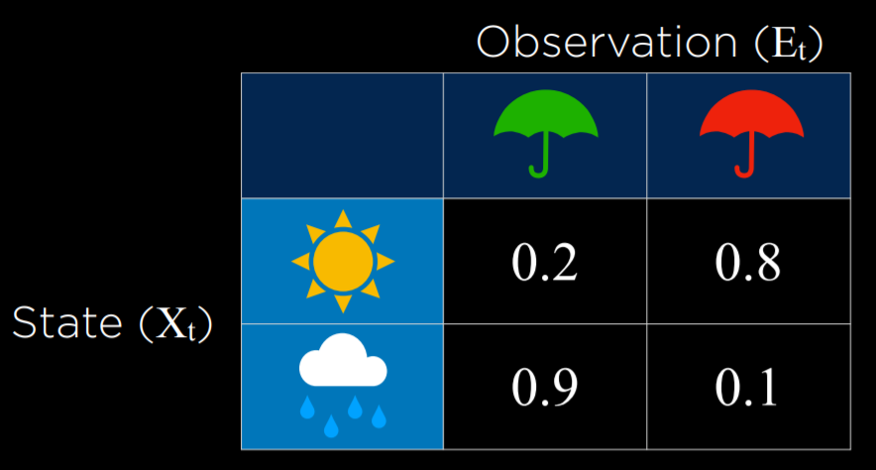

# CS50 人工智能 - Lecture 2 笔记

来源: https://cs50.harvard.edu/ai/2024/notes/2/

## 第二讲

### 不确定性

上节课，我们讨论了人工智能如何表示和推导出新的知识。然而，在现实中，人工智能通常只掌握关于世界的部分知识，留下了不确定性的空间。尽管如此，我们仍然希望我们的人工智能在这些情况下做出最佳的决策。例如，在预测天气时，人工智能掌握了今天的天气信息，但无法 100% 准确地预测明天的天气。尽管如此，我们仍然可以做得比碰运气更好，今天的课程就是关于我们如何创建人工智能，使其在信息有限和不确定的情况下做出最优决策。

### 概率

不确定性可以用一系列事件以及每个事件发生的可能性或概率来表示。

**可能的世界**

每一种可能的情况都可以被认为是一个世界，用小写希腊字母 omega ω 表示。例如，掷骰子可能会产生六个可能的世界：一个骰子点数为 1 的世界，一个骰子点数为 2 的世界，依此类推。为了表示某个世界的概率，我们写成 P(ω)。

**概率公理**

- 0 < P(ω) < 1：每个表示概率的值都必须在 0 和 1 之间。
  - 零是一个不可能发生的事件，比如掷一个标准骰子得到 7。
  - 一是一个肯定会发生的事件，比如掷一个标准骰子得到一个小于 10 的值。
  - 一般来说，数值越高，事件发生的可能性就越大。
- 所有可能事件的概率之和等于 1。

掷一个标准骰子得到数字 R 的概率可以表示为 P(R)。在我们的例子中，P(R) = 1/6，因为有六个可能的世界（掷出 1 到 6 之间的任何数字），并且每个世界发生的可能性都相同。现在，考虑掷两个骰子的事件。现在，有 36 个可能的事件，它们再次具有相同的可能性。

然而，如果我们尝试预测两个骰子的总和会发生什么？在这种情况下，我们只有 11 个可能的值（总和必须在 2 到 12 之间），并且它们发生的频率并不相同。

为了获得一个事件的概率，我们将事件发生的世界的数量除以世界总数。例如，掷两个骰子时有 36 个可能的世界。只有在其中一个世界中，当两个骰子都掷出 6 时，我们才会得到总和 12。因此，P(12) = 1/36，或者用文字来说，掷两个骰子并得到两个数字之和为 12 的概率是 1/36。P(7) 是多少？我们数一下，看到总和 7 出现在 6 个世界中。因此，P(7) = 6/36 = 1/6。

**无条件概率**

无条件概率是在没有任何其他证据的情况下，对一个命题的置信程度。到目前为止，我们提出的所有问题都是无条件概率的问题，因为掷骰子的结果不依赖于之前的事件。

### 条件概率

条件概率是在已经揭示某些证据的情况下，对一个命题的置信程度。正如引言中所讨论的，人工智能可以使用部分信息来对未来做出有根据的猜测。为了使用这些影响未来事件发生概率的信息，我们依赖于条件概率。

条件概率使用以下符号表示：P(a | b)，意思是“在已知事件 b 已经发生的情况下，事件 a 发生的概率”，或者更简洁地说，“在 b 条件下 a 的概率”。现在我们可以问一些问题，比如在昨天下了雨的情况下，今天下雨的概率 P(今天下雨 | 昨天雨)，或者在患者的测试结果已知的情况下，患者患有该疾病的概率 P(疾病 | 测试结果)。

在数学上，为了计算在 b 条件下 a 的条件概率，我们使用以下公式：

P(a|b) = P(a ∧ b) / P(b)

用文字表达，a 在 b 条件下为真的概率等于 a 和 b 都为真的概率，除以 b 为真的概率。对此进行推理的一种直观方式是思考“我们对 a 和 b 都为真的事件（分子）感兴趣，但仅从我们知道 b 为真的世界（分母）中”。除以 b 将可能的世界限制为 b 为真的世界。以下是与上述公式代数等价的形式：

P(a ∧ b) = P(a|b) _ P(b)
P(a ∧ b) = P(b|a) _ P(a)
P(a|b) = P(b|a) \* P(a) / P(b)

例如，考虑 P(总和 12 | 一个骰子掷出 6)，或者掷两个骰子得到总和为 12 的概率，前提是我们已经掷出一个骰子并得到 6。为了计算这个，我们首先将我们的世界限制为第一个骰子的值为 6 的世界：

P(总和 12 | 第一个骰子为 6) = P(总和 12 ∧ 第一个骰子为 6) / P(第一个骰子为 6)

现在我们问，在我们限制问题的世界中（除以 P(b)，或第一个骰子掷出 6 的概率），事件 a（总和为 12）发生了多少次。

### 随机变量

随机变量是概率论中的一个变量，其域是它可以取值的可能值。例如，为了表示掷骰子的可能结果，我们可以定义一个随机变量 Roll，它可以取值 {1, 2, 3, 4, 5, 6}。为了表示航班的状态，我们可以定义一个变量 Flight，它可以取值 {准时, 延误, 取消}。

通常，我们对每个值发生的概率感兴趣。我们使用概率分布来表示这一点。例如，

- P(Flight = 准时) = 0.6
- P(Flight = 延误) = 0.3
- P(Flight = 取消) = 0.1

用文字解释概率分布，这意味着航班有 60% 的可能性准时，30% 的可能性延误，10% 的可能性取消。请注意，如前所示，所有可能结果的概率之和为 1。

概率分布可以更简洁地表示为向量。例如，P(Flight) = <0.6, 0.3, 0.1>。为了使这种表示法可解释，这些值具有设定的顺序（在我们的例子中，准时、延误、取消）。

**独立性**

独立性是指一个事件的发生不影响另一个事件的概率的知识。例如，在掷两个骰子时，每个骰子的结果都与其他骰子无关。第一个骰子掷出 4 不会影响我们掷出的第二个骰子的值。这与相关事件相反，例如早晨多云和下午下雨。如果早晨多云，那么早上更有可能下雨，因此这些事件是相关的。

独立性可以用数学方式定义：事件 a 和 b 是独立的，当且仅当 a 和 b 的概率等于 a 的概率乘以 b 的概率：P(a ∧ b) = P(a)P(b)。

### 贝叶斯规则

贝叶斯规则通常用于概率论中计算条件概率。用文字表达，贝叶斯规则指出，b 在 a 条件下的概率等于 a 在 b 条件下的概率，乘以 b 的概率，再除以 a 的概率。

P(b|a) = P(a|b) \* P(b) / P(a)

例如，我们想计算如果早上多云，下午下雨的概率，或 P(下雨 | 多云)。我们从以下信息开始：

- 80% 的雨天下午从多云的早晨开始，或 P(多云 | 下雨)。
- 40% 的日子早晨多云，或 P(多云)。
- 10% 的日子下午下雨，或 P(下雨)。

应用贝叶斯规则，我们计算 (0.1)(0.8)/(0.4) = 0.2。也就是说，在早上多云的情况下，下午下雨的概率是 20%。

知道 P(a | b)，除了 P(a) 和 P(b) 之外，还允许我们计算 P(b | a)。这很有帮助，因为知道可见效果在未知原因条件下的条件概率 P(可见效果 | 未知原因)，使我们能够计算未知原因在可见效果条件下的概率 P(未知原因 | 可见效果)。例如，我们可以通过医学试验了解 P(医学测试结果 | 疾病)，在医学试验中，我们测试患有该疾病的人，并查看测试检测到该疾病的频率。了解这一点后，我们可以计算 P(疾病 | 医学测试结果)，这是有价值的诊断信息。

### 联合概率

联合概率是多个事件同时发生的可能性。

让我们考虑以下示例，涉及早晨多云和下午下雨的概率。

|            | 下午下雨 | 下午不下雨 |
| ---------- | -------- | ---------- |
| 早晨多云   | 0.08     | 0.32       |
| 早晨不下雨 | 0.02     | 0.58       |

查看这些数据，我们无法判断早晨多云是否与下午下雨的可能性有关。为了能够做到这一点，我们需要查看两个变量所有可能结果的联合概率。我们可以用表格形式表示如下：

|            | 下午下雨 | 下午不下雨 | 总计 |
| ---------- | -------- | ---------- | ---- |
| 早晨多云   | 0.08     | 0.32       | 0.4  |
| 早晨不下雨 | 0.02     | 0.58       | 0.6  |
| 总计       | 0.1      | 0.9        | 1.0  |

现在我们能够了解事件共同发生的信息。例如，我们知道某一天早晨多云且下午下雨的概率是 0.08。早晨不下雨且下午不下雨的概率是 0.58。

使用联合概率，我们可以推导出条件概率。例如，如果我们对下午下雨的情况下早晨多云的概率分布感兴趣。P(C | 下雨) = P(C, 下雨)/P(下雨)（旁注：在概率中，逗号和 ∧ 可以互换使用。因此，P(C, 下雨) = P(C ∧ 下雨)）。用文字表达，我们将下雨和多云的联合概率除以下雨的概率。

在最后一个等式中，可以将 P(下雨) 视为 P(C, 下雨) 乘以的某个常数。因此，我们可以将 P(C, 下雨)/P(下雨) 重写为 αP(C, 下雨)，或 α<0.08, 0.02>。分解出 α 后，我们得到了在下午下雨的情况下 C 可能值的概率比例。也就是说，如果下午下雨，则早晨多云和早晨不下雨的概率比例为 0.08:0.02。请注意，0.08 和 0.02 的总和不为 1；但是，由于这是随机变量 C 的概率分布，我们知道它们应该总和为 1。因此，我们需要通过计算 α 来归一化这些值，使得 α0.08 + α0.02 = 1。最后，我们可以说 P(C | 下雨) = <0.8, 0.2>。

### 概率规则

- **否定**：P(¬a) = 1 - P(a)。这源于所有可能世界的概率之和为 1，而互补文字 a 和 ¬a 包括所有可能世界。
- **容斥**：P(a ∨ b) = P(a) + P(b) - P(a ∧ b)。这可以解释为：a 或 b 为真的世界等于 a 为真的所有世界，加上 b 为真的世界。但是，在这种情况下，某些世界被计算了两次（a 和 b 都为真的世界）。为了消除这种重叠，我们减去一次 a 和 b 都为真的世界（因为它们被计算了两次）。

> 这是一个课外的例子，可以阐明这一点。假设我 80% 的日子吃冰淇淋，70% 的日子吃饼干。如果我们计算我今天吃冰淇淋或饼干的概率 P(冰淇淋 ∨ 饼干) 而不减去 P(冰淇淋 ∧ 饼干)，我们错误地得到 0.7 + 0.8 = 1.5。这与概率在 0 到 1 之间的公理相矛盾。为了纠正将我同时吃冰淇淋和饼干的日子计算两次的情况，我们需要减去一次 P(冰淇淋 ∧ 饼干)。

- **边缘化**：P(a) = P(a, b) + P(a, ¬b)。这里的想法是 b 和 ¬b 是不相交的概率。也就是说，b 和 ¬b 同时发生的概率为 0。我们也知道 b 和 ¬b 的总和为 1。因此，当 a 发生时，b 可能发生也可能不发生。当我们取 a 和 b 都发生的概率加上 a 和 ¬b 的概率时，我们最终得到的就是 a 的概率。

> 这是一个课外的例子，可以阐明这一点。假设我 80% 的日子吃冰淇淋，70% 的日子吃饼干。如果我们计算我今天吃冰淇淋或饼干的概率 P(冰淇淋 ∨ 饼干) 而不减去 P(冰淇淋 ∧ 饼干)，我们错误地得到 0.7 + 0.8 = 1.5。这与概率在 0 到 1 之间的公理相矛盾。为了纠正将我同时吃冰淇淋和饼干的日子计算两次的情况，我们需要减去一次 P(冰淇淋 ∧ 饼干)。

边缘化可以为随机变量表示为以下方式：

P(X = xᵢ) = ∑ⱼ P(X = xᵢ, Y = yⱼ)

等式的左侧表示“随机变量 X 具有值 xᵢ 的概率”。例如，对于我们之前提到的变量 C，两个可能的值是早晨多云和早晨不下雨。等式的右侧是边缘化的思想。P(X = xᵢ) 等于 xᵢ 和随机变量 Y 的每个值的每个联合概率之和。例如，P(C = 多云) = P(C = 多云, R = 下雨) + P(C = 多云, R = ¬ 下雨) = 0.08 + 0.32 = 0.4。

- **条件化**：P(a) = P(a | b)P(b) + P(a | ¬b)P(¬b)。这与边缘化的思想类似。事件 a 发生的概率等于 a 在 b 条件下的概率乘以 b 的概率，加上 a 在 ¬b 条件下的概率乘以 ¬b 的概率。

P(X = xᵢ) = ∑ⱼ P(X = xᵢ | Y = yⱼ)P(Y = yⱼ)

在这个公式中，随机变量 X 取值 xᵢ 的概率等于 xᵢ 在随机变量 Y 的每个值条件下的概率乘以变量 Y 取该值的概率之和。如果我们记住 P(a | b) = P(a, b)/P(b)，这就有意义了。如果我们将这个表达式乘以 P(b)，我们最终得到 P(a, b)，从这里我们做的事情与我们对边缘化所做的事情相同。

### 贝叶斯网络

贝叶斯网络是一种数据结构，用于表示随机变量之间的依赖关系。贝叶斯网络具有以下属性：

- 它们是有向图。
- 图上的每个节点代表一个随机变量。
- 从 X 到 Y 的箭头表示 X 是 Y 的父节点。也就是说，Y 的概率分布取决于 X 的值。
- 每个节点 X 都有概率分布 P(X | Parents(X))。

让我们考虑一个贝叶斯网络的例子，该网络涉及影响我们是否准时赴约的变量。



让我们从上到下描述这个贝叶斯网络：

- **Rain** 是这个网络中的根节点。这意味着它的概率分布不依赖于任何先前的事件。在我们的例子中，Rain 是一个随机变量，它可以取值 {none, light, heavy}，概率分布如下：

|       | 概率 |
| ----- | ---- |
| none  | 0.7  |
| light | 0.2  |
| heavy | 0.1  |

- **Maintenance**，在我们的例子中，编码了是否存在轨道维护，取值 {yes, no}。Rain 是 Maintenance 的父节点，这意味着 Maintenance 的概率分布受 Rain 的影响。

| R     | yes | no  |
| ----- | --- | --- |
| none  | 0.4 | 0.6 |
| light | 0.2 | 0.8 |
| heavy | 0.1 | 0.9 |

- **Train** 是编码火车是否准时或延误的变量，取值 {on time, delayed}。请注意，Train 有来自 Maintenance 和 Rain 的箭头指向它。这意味着两者都是 Train 的父节点，它们的值会影响 Train 的概率分布。

| R     | M   | on time | delayed |
| ----- | --- | ------- | ------- |
| none  | yes | 0.8     | 0.2     |
| none  | no  | 0.9     | 0.1     |
| light | yes | 0.6     | 0.4     |
| light | no  | 0.7     | 0.3     |
| heavy | yes | 0.4     | 0.6     |
| heavy | no  | 0.5     | 0.5     |

- **Appointment** 是一个随机变量，表示我们是否参加约会，取值 {attend, miss}。请注意，它的唯一父节点是 Train。关于贝叶斯网络的这一点值得注意：父节点仅包括直接关系。轨道维护确实会影响火车是否准时，而火车是否准时会影响我们是否参加约会。但是，最终，直接影响我们参加约会机会的是火车是否准时，这就是贝叶斯网络中表示的内容。例如，如果火车准时到达，可能是大雨和轨道维护，但这不会影响我们是否准时赴约。

| T       | attend | miss |
| ------- | ------ | ---- |
| on time | 0.9    | 0.1  |
| delayed | 0.6    | 0.4  |

例如，如果我们想找到在没有维护和小雨的日子里，当火车延误时错过会议的概率，或 P(light, no, delayed, miss)，我们将计算以下内容：P(light)P(no | light)P(delayed | light, no)P(miss | delayed)。每个单独概率的值都可以在上面的概率分布中找到，然后将这些值相乘以生成 P(no, light, delayed, miss)。

**推断**

在上节课中，我们通过蕴含关系研究了推断。这意味着我们可以根据我们已经掌握的信息明确地得出新信息。我们也可以根据概率推断新信息。虽然这不能让我们确定地知道新信息，但它可以让我们弄清楚某些值的概率分布。推断具有多种属性。

- **查询 X**：我们想要计算概率分布的变量。
- **证据变量 E**：一个或多个已观察到事件 e 的变量。例如，我们可能已经观察到有小雨，并且此观察结果有助于我们计算火车延误的概率。
- **隐藏变量 Y**：不是查询变量且尚未观察到的变量。例如，站在火车站，我们可以观察到是否下雨，但我们无法知道轨道下游是否正在维护。因此，在这种情况下，Maintenance 将是一个隐藏变量。
- **目标**：计算 P(X | e)。例如，根据我们知道有小雨的证据 e，计算 Train 变量（查询）的概率分布。

让我们举个例子。我们想要计算在有小雨且没有轨道维护的证据下，Appointment 变量的概率分布。也就是说，我们知道有小雨且没有轨道维护，我们想弄清楚我们参加约会和错过约会的概率是多少，P(Appointment | light, no)。从联合概率部分，我们知道我们可以将 Appointment 随机变量的可能值表示为比例，将 P(Appointment | light, no) 重写为 αP(Appointment, light, no)。如果 Appointment 的父节点只是 Train 变量，而不是 Rain 或 Maintenance，我们如何计算 Appointment 的概率分布？在这里，我们将使用边缘化。P(Appointment, light, no) 的值等于 α[P(Appointment, light, no, delayed) + P(Appointment, light, no, on time)]。

**枚举推断**

枚举推断是找到变量 X 在给定观察到的证据 e 和一些隐藏变量 Y 的条件下的概率分布的过程。

<!-- P(X | e) = α ∑<binary data, 1 bytes><binary data, 1 bytes><binary data, 1 bytes><binary data, 1 bytes> P(X, e, y) -->

在这个等式中，X 代表查询变量，e 代表观察到的证据，y 代表隐藏变量的所有值，α 归一化结果，使得我们最终得到的概率总和为 1。用文字解释这个等式，它说 X 在 e 条件下的概率分布等于 X 和 e 的归一化概率分布。为了得到这个分布，我们对 X、e 和 y 的归一化概率求和，其中 y 每次取隐藏变量 Y 的不同值。

Python 中存在多个库，可以简化概率推断的过程。我们将看一下 pomegranate 库，看看如何用代码表示上述数据。

首先，我们创建节点并为每个节点提供概率分布。

```python
from pomegranate import *

# Rain 节点没有父节点
rain = Node(DiscreteDistribution({
    "none": 0.7,
    "light": 0.2,
    "heavy": 0.1
}), name="rain")

# Track maintenance 节点以 rain 为条件
maintenance = Node(ConditionalProbabilityTable([
    ["none", "yes", 0.4],
    ["none", "no", 0.6],
    ["light", "yes", 0.2],
    ["light", "no", 0.8],
    ["heavy", "yes", 0.1],
    ["heavy", "no", 0.9]
], [rain.distribution]), name="maintenance")

# Train 节点以 rain 和 maintenance 为条件
train = Node(ConditionalProbabilityTable([
    ["none", "yes", "on time", 0.8],
    ["none", "yes", "delayed", 0.2],
    ["none", "no", "on time", 0.9],
    ["none", "no", "delayed", 0.1],
    ["light", "yes", "on time", 0.6],
    ["light", "yes", "delayed", 0.4],
    ["light", "no", "on time", 0.7],
    ["light", "no", "delayed", 0.3],
    ["heavy", "yes", "on time", 0.4],
    ["heavy", "yes", "delayed", 0.6],
    ["heavy", "no", "on time", 0.5],
    ["heavy", "no", "delayed", 0.5],
], [rain.distribution, maintenance.distribution]), name="train")

# Appointment 节点以 train 为条件
appointment = Node(ConditionalProbabilityTable([
    ["on time", "attend", 0.9],
    ["on time", "miss", 0.1],
    ["delayed", "attend", 0.6],
    ["delayed", "miss", 0.4]
], [train.distribution]), name="appointment")
```

其次，我们通过添加所有节点并描述哪个节点是哪个其他节点的父节点来创建模型，方法是在它们之间添加边（回想一下，贝叶斯网络是一个有向图，由节点和它们之间的箭头组成）。

```python
# 创建贝叶斯网络并添加状态
model = BayesianNetwork()
model.add_states(rain, maintenance, train, appointment)

# 添加连接节点的边
model.add_edge(rain, maintenance)
model.add_edge(rain, train)
model.add_edge(maintenance, train)
model.add_edge(train, appointment)

# 完成模型
model.bake()
```

现在，为了询问某个事件发生的可能性有多大，我们使用我们感兴趣的值运行模型。在这个例子中，我们想问在没有下雨、没有轨道维护、火车准时且我们参加会议的情况下，概率是多少。

```python
# 计算给定观察值的概率
probability = model.probability([["none", "no", "on time", "attend"]])

print(probability)
```

否则，我们可以使用该程序根据一些观察到的证据为所有变量提供概率分布。在以下情况下，我们知道火车延误了。鉴于此信息，我们计算并打印变量 Rain、Maintenance 和 Appointment 的概率分布。

```python
# 根据火车延误的证据计算预测
predictions = model.predict_proba({
    "train": "delayed"
})

# 打印每个节点的预测
for node, prediction in zip(model.states, predictions):
    if isinstance(prediction, str):
        print(f"{node.name}: {prediction}")
    else:
        print(f"{node.name}")
        for value, probability in prediction.parameters[0].items():
            print(f"    {value}: {probability:.4f}")
```

上面的代码使用了枚举推断。但是，这种计算概率的方式效率低下，尤其是在模型中存在许多变量时。另一种方法是放弃精确推断，转而使用近似推断。这样做，我们在生成的概率中会损失一些精度，但通常这种不精确性可以忽略不计。相反，我们获得了一种可扩展的计算概率的方法。

### 抽样

抽样是近似推断的一种技术。在抽样中，每个变量都根据其概率分布进行值抽样。我们将从一个课外示例开始，然后介绍课程中的示例。

为了使用骰子通过抽样生成分布，我们可以多次掷骰子并记录每次得到的值。假设我们掷了 600 次骰子。我们计算得到 1 的次数，这应该是大约 100 次，然后对其余值 2-6 重复此操作。然后，我们将每个计数除以总掷骰次数。这将生成骰子值的大致分布：一方面，我们不太可能得到每个值发生的概率为 1/6 的结果（这是精确概率），但我们将得到一个接近它的值。

以下是课程中的一个示例：如果我们从抽样 Rain 变量开始，值 none 将以 0.7 的概率生成，值 light 将以 0.2 的概率生成，值 heavy 将以 0.1 的概率生成。假设我们得到的抽样值为 none。当我们到达 Maintenance 变量时，我们也对其进行抽样，但仅从 Rain 等于 none 的概率分布中抽样，因为这是一个已经抽样的结果。我们将继续对所有节点执行此操作。现在我们有一个样本，重复此过程多次会生成一个分布。现在，如果我们想回答一个问题，例如 P(Train = 准时) 是多少，我们可以计算变量 Train 的值为准时的样本数量，并将结果除以样本总数。这样，我们就生成了 P(Train = 准时) 的近似概率。

我们还可以回答涉及条件概率的问题，例如 P(Rain = light | Train = 准时)。在这种情况下，我们忽略所有 Train 的值不是准时的样本，然后像以前一样继续。我们计算在 Train = 准时的样本中，有多少样本的变量 Rain = light，然后除以 Train = 准时的样本总数。

在代码中，抽样函数可以如下所示：generate_sample：

```python
import pomegranate

from collections import Counter

from model import model

def generate_sample():

    # 随机变量名称到生成的样本的映射
    sample = {}

    # 分布到生成的样本的映射
    parents = {}

    # 循环遍历所有状态，假设拓扑顺序
    for state in model.states:

        # 如果我们有一个非根节点，则以父节点为条件进行抽样
        if isinstance(state.distribution, pomegranate.ConditionalProbabilityTable):
            sample[state.name] = state.distribution.sample(parent_values=parents)

        # 否则，仅从分布中抽样
        else:
            sample[state.name] = state.distribution.sample()

        # 跟踪父映射中的抽样值
        parents[state.distribution] = sample[state.name]

    # 返回生成的样本
    return sample
```

现在，为了计算 P(Appointment | Train = 延误)，即在火车延误的情况下 Appointment 变量的概率分布，我们执行以下操作：

```python
# 拒绝抽样
# 计算在火车延误的情况下 Appointment 的分布
N = 10000
data = []

# 重复抽样 10,000 次
for i in range(N):

    # 根据我们之前定义的函数生成样本
    sample = generate_sample()

    # 如果在这个样本中，Train 变量的值为延误，则保存样本。由于我们对在火车延误的情况下 Appointment 的概率分布感兴趣，因此我们丢弃火车准时的样本。
    if sample["train"] == "delayed":
        data.append(sample["appointment"])

# 计算每个变量值出现的次数。稍后我们可以通过将结果除以保存的样本总数来归一化结果，以获得变量的近似概率，这些概率加起来为 1。
print(Counter(data))
```

**可能性加权**

在上面的抽样示例中，我们丢弃了与我们掌握的证据不符的样本。这是低效的。一种解决此问题的方法是使用可能性加权，使用以下步骤：

- 首先固定证据变量的值。
- 使用贝叶斯网络中的条件概率对非证据变量进行抽样。
- 通过每个样本的可能性对其进行加权：所有证据发生的概率。

例如，如果我们观察到火车准时，我们将像以前一样开始抽样。我们根据 Rain 的概率分布抽样 Rain 的值，然后抽样 Maintenance，但是当我们到达 Train 时 - 我们始终为其提供观察到的值，在我们的例子中为准时。然后，我们根据 Appointment 的概率分布（在 Train = 准时的情况下）继续抽样 Appointment。既然存在此样本，我们将通过观察到的变量在其抽样的父节点条件下的条件概率对其进行加权。也就是说，如果我们抽样 Rain 并得到 light，然后我们抽样 Maintenance 并得到 yes，那么我们将通过 P(Train = 准时 | light, yes) 对此样本进行加权。

### 马尔可夫模型

到目前为止，我们已经研究了在给定我们观察到的一些信息的情况下概率的问题。在这种范式中，时间维度没有以任何方式表示。但是，许多任务确实依赖于时间维度，例如预测。为了表示时间变量，我们将创建一个新变量 X，并根据感兴趣的事件更改它，使得 Xₜ 是当前事件，Xₜ₊₁ 是下一个事件，依此类推。为了能够预测未来的事件，我们将使用马尔可夫模型。

**马尔可夫假设**

马尔可夫假设是当前状态仅取决于有限的固定数量的先前状态的假设。这对我们很重要。考虑预测天气的任务。从理论上讲，我们可以使用过去一年的所有数据来预测明天的天气。但是，这是不可行的，既因为这将需要的计算能力，也因为可能没有关于明天天气基于 365 天前天气的条件概率的信息。使用马尔可夫假设，我们限制了我们之前的状态（例如，在预测明天天气时我们将考虑多少天前），从而使任务可管理。这意味着我们可能会得到我们感兴趣的概率的更粗略的近似值，但这通常足以满足我们的需求。此外，我们可以使用基于上一个事件信息的马尔可夫模型（例如，基于今天的天气预测明天的天气）。

**马尔可夫链**

马尔可夫链是随机变量的序列，其中每个变量的分布都遵循马尔可夫假设。也就是说，链中的每个事件都基于其之前事件的概率发生。

为了开始构建马尔可夫链，我们需要一个转移模型，该模型将指定基于当前事件可能值的下一个事件的概率分布。


在这个例子中，明天晴朗的概率基于今天晴朗是 0.8。这是合理的，因为晴天之后更有可能出现晴天。但是，如果今天下雨，则明天降雨的概率为 0.7，因为雨天更有可能彼此相随。使用此转移模型，可以对马尔可夫链进行抽样。从一天是晴天还是雨天开始，然后根据给定今天天气的晴天或雨天的概率对第二天进行抽样。然后，根据明天的情况来调节后天概率，依此类推，从而产生马尔可夫链：


给定此马尔可夫链，我们现在可以回答诸如“连续四天下雨的概率是多少？”之类的问题。以下是如何在代码中实现马尔可夫链的示例：

```python
from pomegranate import *

# 定义起始概率
start = DiscreteDistribution({
    "sun": 0.5,
    "rain": 0.5
})

# 定义转移模型
transitions = ConditionalProbabilityTable([
    ["sun", "sun", 0.8],
    ["sun", "rain", 0.2],
    ["rain", "sun", 0.3],
    ["rain", "rain", 0.7]
], [start])

# 创建马尔可夫链
model = MarkovChain([start, transitions])

# 从链中抽样 50 个状态
print(model.sample(50))
```

### 隐马尔可夫模型

隐马尔可夫模型是一种马尔可夫模型，用于具有生成某些观察到的事件的隐藏状态的系统。这意味着有时，人工智能对世界进行了一些测量，但无法访问世界的精确状态。在这些情况下，世界的状态称为隐藏状态，而人工智能可以访问的任何数据都是观察结果。以下是一些示例：

- 对于探索未知领域的机器人，隐藏状态是其位置，观察结果是机器人传感器记录的数据。
- 在语音识别中，隐藏状态是说出的单词，观察结果是音频波形。
- 在衡量网站上的用户参与度时，隐藏状态是用户的参与度，观察结果是网站或应用程序分析。

对于我们的讨论，我们将使用以下示例。我们的人工智能想要推断天气（隐藏状态），但它只能访问室内摄像头，该摄像头记录了有多少人带了雨伞。这是我们的传感器模型（也称为发射模型），它表示这些概率：


在这个模型中，如果是晴天，人们最有可能不带雨伞去大楼。如果下雨，那么人们很可能会带雨伞去大楼。通过使用人们是否带雨伞的观察结果，我们可以合理地预测外面的天气。

**传感器马尔可夫假设**

证据变量仅取决于相应状态的假设。例如，对于我们的模型，我们假设人们是否带雨伞去办公室仅取决于天气。这不一定反映完整的事实，因为例如，更认真的、厌恶雨水的人即使在晴天也可能随身携带雨伞，如果我们知道每个人的个性，它将为模型添加更多数据。但是，传感器马尔可夫假设忽略了这些数据，假设只有隐藏状态会影响观察结果。

隐马尔可夫模型可以用具有两层的马尔可夫链表示。顶层变量 X 代表隐藏状态。底层变量 E 代表证据，即我们拥有的观察结果。


基于隐马尔可夫模型，可以实现多个任务：

- **过滤**：给定从开始到现在为止的观察结果，计算当前状态的概率分布。例如，给定人们从开始到现在为止带雨伞的信息，我们生成今天是否下雨的概率分布。
- **预测**：给定从开始到现在为止的观察结果，计算未来状态的概率分布。
- **平滑**：给定从开始到现在为止的观察结果，计算过去状态的概率分布。例如，计算昨天是否下雨的概率，前提是今天人们带了雨伞。
- **最可能的解释**：给定从开始到现在为止的观察结果，计算最可能的事件序列。

最可能的解释任务可以用于语音识别等过程中，在语音识别中，人工智能根据多个波形推断出导致这些波形的最可能的单词或音节序列。接下来是一个隐马尔可夫模型的 Python 实现，我们将使用它来完成最可能的解释任务：

```python
from pomegranate import *
import numpy

# 每个状态的观察模型
sun = DiscreteDistribution({
    "umbrella": 0.2,
    "no umbrella": 0.8
})

rain = DiscreteDistribution({
    "umbrella": 0.9,
    "no umbrella": 0.1
})

states = [sun, rain]

# 转移模型
transitions = numpy.array(
    [[0.8, 0.2], # 如果今天 = 晴天，则为明天的预测
     [0.3, 0.7]] # 如果今天 = 雨天，则为明天的预测
)

# 起始概率
starts = numpy.array([0.5, 0.5])

# 创建模型
model = HiddenMarkovModel.from_matrix(
    transitions, states, starts,
    state_names=["sun", "rain"]
)
model.bake()
```

请注意，我们的模型同时具有传感器模型和转移模型。对于隐马尔可夫模型，我们两者都需要。在以下代码片段中，我们看到了一系列关于人们是否带雨伞去大楼的观察结果，并且基于此序列，我们将运行模型，该模型将生成并打印最可能的解释（即最有可能导致这种观察模式的天气序列）：

```python
from model import model

# 观察到的数据
observations = [
    "umbrella",
    "umbrella",
    "no umbrella",
    "umbrella",
    "umbrella",
    "umbrella",
    "umbrella",
    "no umbrella",
    "no umbrella"
]

# 预测底层状态
predictions = model.predict(observations)
for prediction in predictions:
    print(model.states[prediction].name)
```

在这种情况下，程序的输出将是 rain, rain, sun, rain, rain, rain, rain, sun, sun。此输出表示在人们带或不带雨伞去大楼的观察结果下，最有可能的天气模式是什么。
