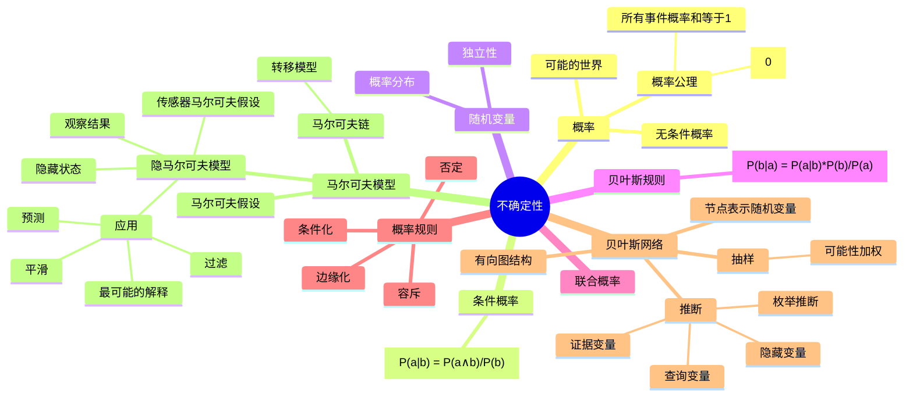

# 人工智能中的不确定性与概率推理总结

人工智能通常只掌握关于世界的部分知识，需要在不确定情况下做出决策。本文档介绍了处理不确定性的各种概率方法和模型。

## 主要概念关系

概率论是处理不确定性的基础，提供了计算和推理的工具。条件概率和贝叶斯规则帮助我们利用观察到的证据更新信念。随机变量和贝叶斯网络提供了建模复杂问题的框架。马尔可夫模型处理涉及时间的推理问题。抽样方法帮助解决复杂推理场景。

## 思维导图

以上思维导图展示了处理不确定性的关键概念及其关系。从基础概率理论出发，通过条件概率和贝叶斯规则，发展到更复杂的模型如贝叶斯网络和马尔可夫模型，使AI能在信息有限的情况下做出最优决策。