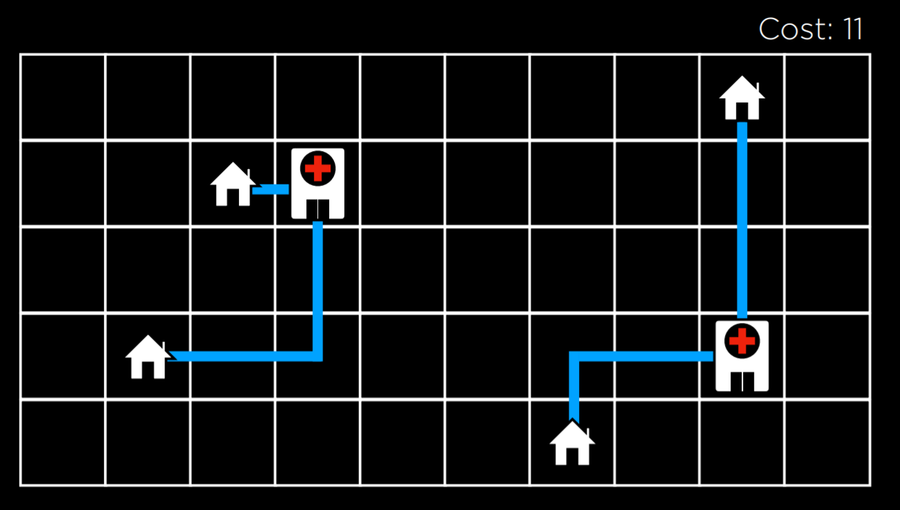
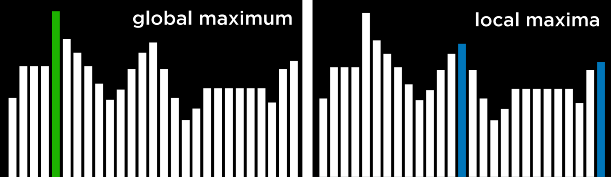
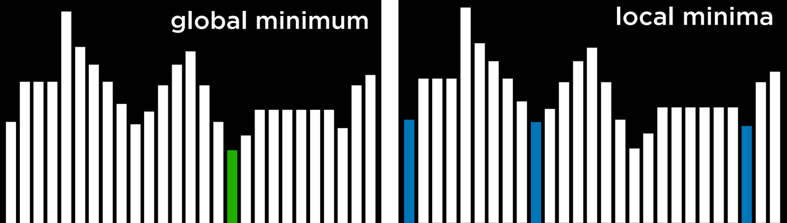
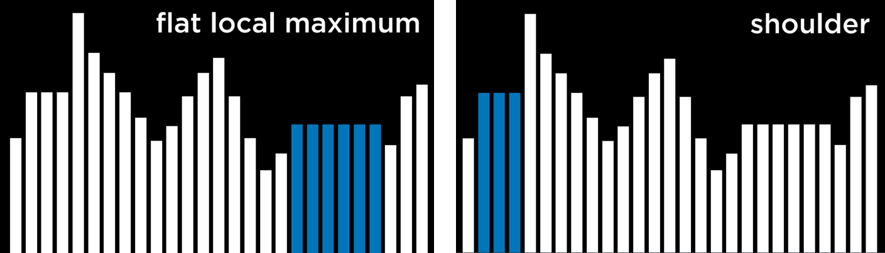
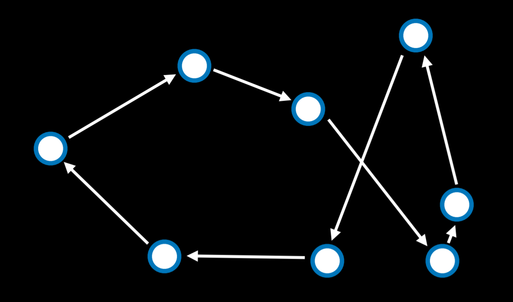
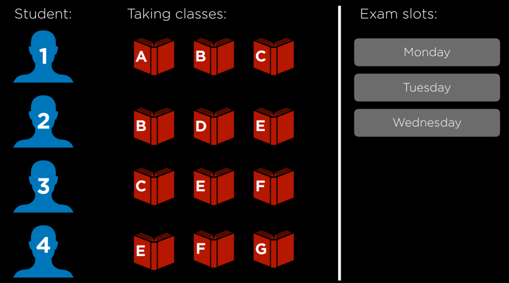
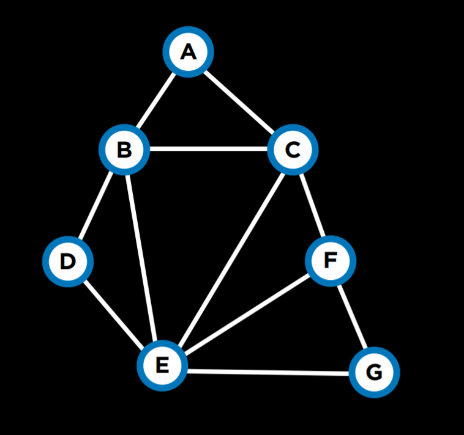
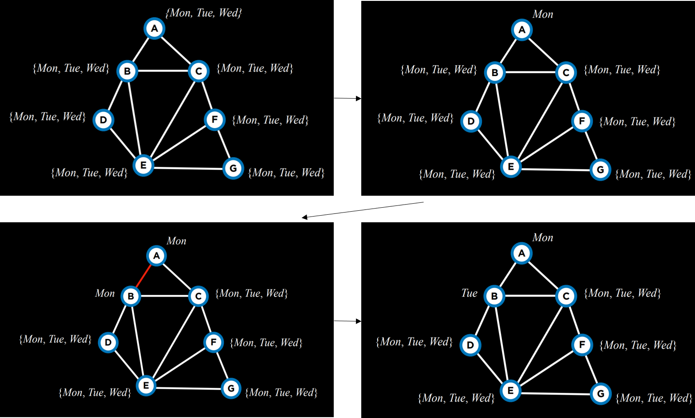
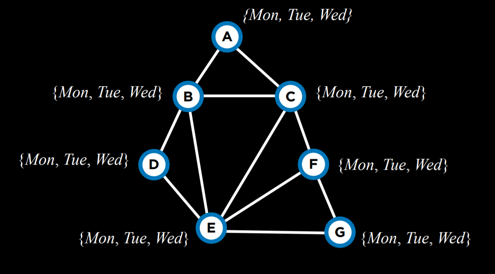
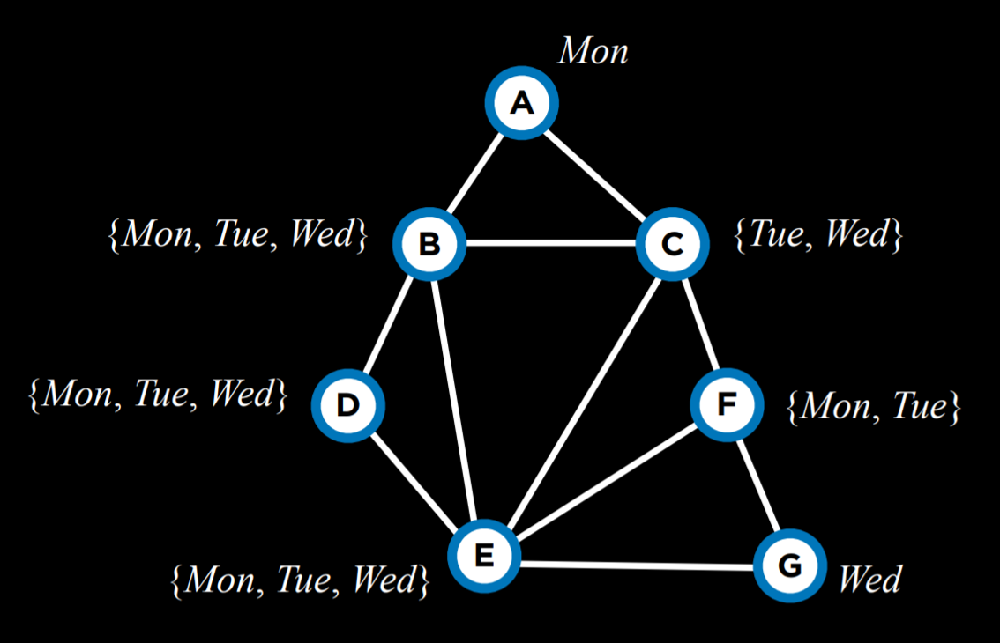

# Lecture 3

## Optimization

优化是从一组可能的选项中选择最佳选项。我们已经遇到过尝试找到最佳选项的问题，例如在极小极大算法中，今天我们将学习可以用来解决更广泛问题的工具。

## 局部搜索

局部搜索是一种搜索算法，它维护单个节点，并通过移动到相邻节点来进行搜索。这种类型的算法与我们之前看到的搜索类型不同。例如，在迷宫求解中，我们希望找到到达目标的*最快*方法，而局部搜索则感兴趣于找到问题的*最佳答案*。通常，局部搜索会给出一个*“足够好”*的答案，而不是最优答案，从而节省计算能力。考虑以下局部搜索问题的例子：我们在固定位置有四个房子。我们希望建造两家医院，以最大限度地减少每个房子到医院的距离。这个问题可以可视化如下：

![\[图片展示了房子和医院的配置，以及它们之间的距离，并提到了使用曼哈顿距离。\]](image.png)

在这个图中，我们看到了房子和医院的可能配置。它们之间的距离使用曼哈顿距离（上下左右移动的次数；在讲座 0 中有更详细的讨论）来衡量，并且每个房子到最近医院的距离总和是 17。我们称之为*成本*，因为我们试图最小化这个距离。在这种情况下，一个状态将是房子和医院的任何一种配置。

抽象这个概念，我们可以将房子和医院的每个配置表示为下面的状态空间景观。图片中的每个条形代表一个状态的值，在我们的例子中，这将是房子和医院的某个配置的成本。

![\[图片展示了一个状态空间景观，其中横轴代表状态，纵轴代表状态的值，形成了类似山丘的形状。\]](image-1.png)

从这个可视化出发，我们可以定义几个重要的术语，用于我们其余的讨论：

- **目标函数**是一个我们用来最大化解决方案值的函数。
- **成本函数**是一个我们用来最小化解决方案成本的函数（这是我们在房子和医院的例子中使用的函数。我们希望最小化房子到医院的距离）。
- **当前状态**是当前由该函数考虑的状态。
- **邻近状态**是当前状态可以转换到的状态。在上面的单维状态空间景观中，邻近状态是当前状态两侧的状态。在我们的例子中，邻近状态可以是将其中一个医院向任何方向移动一步而产生的状态。邻近状态通常与当前状态相似，因此，它们的值与当前状态的值接近。

请注意，局部搜索算法的工作方式是考虑当前状态中的一个节点，然后将该节点移动到当前状态的邻居之一。这与极小极大算法不同，例如，极小极大算法递归地考虑状态空间中的每一个状态。

## 爬山法

爬山法是一种局部搜索算法。在这种算法中，将邻近状态与当前状态进行比较，如果其中任何一个更好，我们就将当前节点从当前状态更改为该邻近状态。什么算作更好，由我们是使用目标函数（偏向于更高的值）还是递减函数（偏向于更低的值）来定义。

爬山算法在伪代码中看起来如下：

```
函数 Hill-Climb(problem):
    current = 问题的初始状态
    重复：
        neighbor = 当前的最佳邻居
        如果 neighbor 不比 current 好：
            返回 current
        current = neighbor
```

在这个算法中，我们从一个当前状态开始。在某些问题中，我们知道当前状态是什么，而在另一些问题中，我们将不得不随机选择一个。然后，我们重复以下操作：我们评估邻居，选择具有最佳值的那个。然后，我们将此邻居的值与当前状态的值进行比较。如果邻居更好，我们将当前状态切换到邻居状态，然后重复该过程。当我们将最佳邻居与当前状态进行比较，并且当前状态更好时，该过程结束。然后，我们返回当前状态。

使用爬山算法，我们可以开始改进我们在示例中分配给医院的位置。经过几次转换后，我们得到以下状态：



在这个状态下，成本是 11，比初始状态的 17 有所改进。但是，这还不是最佳状态。例如，将左边的医院移动到左上方的房子下方会带来 9 的成本，这比 11 好。但是，这种版本的爬山算法无法到达那里，因为所有邻近状态的成本至少与当前状态一样高。从这个意义上说，爬山算法是短视的，通常选择比其他状态更好的解决方案，但不一定是所有可能解决方案中最好的。

### 局部和全局最小值和最大值

如上所述，爬山算法可能会陷入局部最大值或最小值。**局部最大值**（复数：最大值）是一个比其邻近状态具有更高值的状态。与此相反，**全局最大值**是一个在状态空间中所有状态中具有最高值的状态。



相反，**局部最小值**（复数：最小值）是一个比其邻近状态具有更低值的状态。与此相反，**全局最小值**是一个在状态空间中所有状态中具有最低值的状态。



爬山算法的问题在于它们可能会陷入局部最小值和最大值。一旦算法到达一个其邻居对该函数来说比当前状态更糟糕的点，算法就会停止。特殊的局部最大值和最小值类型包括**平坦局部最大值/最小值**，其中多个值相等的状态相邻，形成一个邻居值较差的平台，以及**肩部**，其中多个值相等的状态相邻，并且平台的邻居可以更好也可以更差。从平台的中间开始，算法将无法在任何方向上前进。

### 爬山法变体

由于爬山法的局限性，人们已经考虑了多种变体来克服陷入局部最小值和最大值的问题。所有算法的变体都有一个共同点：无论策略如何，每个算法仍然有可能最终陷入局部最小值和最大值，并且无法继续优化。下面的算法的表述使得较高的值更好，但它们也适用于成本函数，其目标是最小化成本。

- **最陡上升**：选择值最高的邻居。这是我们上面讨论的标准变体。
- **随机**：从值较高的邻居中随机选择。这样做，我们选择向任何改进我们值的方向前进。例如，如果值最高的邻居导致局部最大值，而另一个邻居导致全局最大值，这就有意义了。
- **首选**：选择第一个值较高的邻居。
- **随机重启**：多次进行爬山法。每次都从一个随机状态开始。比较每次试验的最大值，并在其中选择最高的。
- **局部束搜索**：选择值最高的 k 个邻居。这与大多数局部搜索算法不同，因为它使用多个节点进行搜索，而不仅仅是一个节点。

尽管局部搜索算法并不总能给出最佳解决方案，但在计算上不可行的情况下，它们通常可以提供足够好的解决方案。

## 模拟退火

虽然我们已经看到了可以改进爬山法的变体，但它们都有一个共同的缺点：一旦算法到达局部最大值，它就会停止运行。模拟退火允许算法在陷入局部最大值时“摆脱”自己。

退火是加热金属并使其缓慢冷却的过程，这可以增强金属的硬度。这被用作模拟退火算法的隐喻，模拟退火算法从高温开始，更容易做出随机决策，并且随着温度降低，它做出随机决策的可能性降低，变得更“坚定”。这种机制允许算法将其状态更改为比当前状态更糟糕的邻居，这就是它如何逃离局部最大值的方式。以下是模拟退火的伪代码：

```
函数 Simulated-Annealing(problem, max):
    current = 问题的初始状态
    对于 t = 1 到 max：
        T = Temperature(t)
        neighbor = current 的随机邻居
        ΔE = 邻居比 current 好多少
        如果 ΔE > 0：
            current = neighbor
        使用概率 e^(ΔE/T) 设置 current = neighbor
    返回 current
```

该算法将一个问题和 max（它应该重复的次数）作为输入。对于每次迭代，使用温度函数设置 T。该函数在早期迭代（当 t 较低时）返回较高的值，在后期迭代（当 t 较高时）返回较低的值。然后，选择一个随机邻居，并计算 ΔE，使其量化邻居状态比当前状态好多少。如果邻居状态比当前状态更好（ΔE > 0），如前所述，我们将当前状态设置为邻居状态。但是，当邻居状态更糟糕（ΔE < 0）时，我们仍然可能会将当前状态设置为该邻居状态，我们这样做是使用概率 e^(ΔE/T)。这里的想法是，负的 ΔE 越多，邻居状态被选中的概率就越低，温度 T 越高，邻居状态被选中的概率就越高。这意味着邻居状态越糟糕，它被选中的可能性就越小，算法越早开始它的过程，它就越有可能将更糟糕的邻居状态设置为当前状态。其背后的数学原理如下：e 是一个常数（大约 2.72），而 ΔE 是负数（因为这个邻居比当前状态更糟糕）。ΔE 越负，结果值就越接近 0。温度 T 越高，ΔE/T 就越接近 0，使概率越接近 1。

### 旅行商问题

在旅行商问题中，任务是连接所有点，同时选择最短的可能距离。例如，这是送货公司需要做的事情：找到从商店到所有客户家并返回的最短路线。



在这种情况下，邻居状态可以看作是两个箭头互换位置的状态。计算每一种可能的组合会使这个问题在计算上要求很高（仅有 10 个点就给出了 10! 或 3,628,800 种可能的路线）。通过使用模拟退火算法，可以以较低的计算成本找到一个好的解决方案。

## 线性规划

线性规划是一类优化线性方程（形式为 y = ax₁ + bx₂ + …）的问题。

线性规划将具有以下组成部分：

- 一个我们希望最小化的**成本函数**：c₁x₁ + c₂x₂ + … + cₙxₙ。在这里，每个 xᵢ 都是一个变量，它与某个成本 cᵢ 相关联。
- 一个**约束**，它表示为变量的总和，该总和小于或等于一个值 (a₁x₁ + a₂x₂ + … + aₙxₙ ≤ b) 或精确等于该值 (a₁x₁ + a₂x₂ + … + aₙxₙ = b)。在这种情况下，xᵢ 是一个变量，aᵢ 是与它相关联的一些资源，而 b 是我们可以专门用于此问题的资源量。
- 对变量的**单个界限**（例如，变量不能为负数），形式为 lᵢ ≤ xᵢ ≤ uᵢ。

考虑以下示例：

- 两台机器，X₁ 和 X₂。运行 X₁ 的成本为 50 美元/小时，运行 X₂ 的成本为 80 美元/小时。目标是最小化成本。这可以形式化为成本函数：50x₁ + 80x₂。
- X₁ 每小时需要 5 个劳动单位。X₂ 每小时需要 2 个劳动单位。总共需要花费 20 个劳动单位。这可以形式化为约束：5x₁ + 2x₂ ≤ 20。
- X₁ 每小时产生 10 个单位的产出。X₂ 每小时产生 12 个单位的产出。公司需要 90 个单位的产出。这是另一个约束。从字面上看，它可以改写为 10x₁ + 12x₂ ≥ 90。但是，约束需要采用 (a₁x₁ + a₂x₂ + … + aₙxₙ ≤ b) 或 (a₁x₁ + a₂x₂ + … + aₙxₙ = b) 的形式。因此，我们乘以 (-1) 得到一个等效的所需形式的方程：(-10x₁) + (-12x₂) ≤ -90。

一个用于线性规划的优化算法需要我们在几何和线性代数方面的背景知识，而我们不想假设这一点。相反，我们可以使用已经存在的算法，例如 Simplex 和 Interior-Point。

以下是一个使用 Python 中 scipy 库的线性规划示例：

```python
import scipy.optimize

# 目标函数：50x_1 + 80x_2
# 约束 1：5x_1 + 2x_2 <= 20
# 约束 2：-10x_1 + -12x_2 <= -90

result = scipy.optimize.linprog(
    [50, 80],  # 成本函数：50x_1 + 80x_2
    A_ub=[[5, 2], [-10, -12]],  # 不等式的系数
    b_ub=[20, -90],  # 不等式的约束：20 和 -90
)

if result.success:
    print(f"X1: {round(result.x[0], 2)} hours")
    print(f"X2: {round(result.x[1], 2)} hours")
else:
    print("No solution")
```

## 约束满足

约束满足问题是一类需要为变量分配值同时满足某些条件的问题。

约束满足问题具有以下属性：

- 一组变量 (x₁, x₂, …, xₙ)
- 每组变量的域 {D₁, D₂, …, Dₙ}
- 一组约束 C

数独可以表示为一个约束满足问题，其中每个空方格都是一个变量，域是数字 1-9，而约束是不能彼此相等的方格。

考虑另一个例子。每个学生 1-4 正在学习 A、B、…、G 中的三门课程。每门课程都需要参加考试，可能的考试日期是周一、周二和周三。但是，同一个学生不能在同一天参加两次考试。在这种情况下，变量是课程，域是日期，约束是哪些课程不能安排在同一天进行考试，因为同一个学生正在学习它们。这可以可视化如下：



这个问题可以使用表示为图的约束来解决。图上的每个节点都是一门课程，如果两门课程不能在同一天安排，则在这两门课程之间绘制一条边。在这种情况下，图将如下所示：



关于约束满足问题，还有几个值得了解的术语：

- **硬约束**是必须在正确解决方案中满足的约束。
- **软约束**是表示哪个解决方案优于其他解决方案的约束。
- **一元约束**是仅涉及一个变量的约束。在我们的例子中，一元约束将是说课程 A 不能在周一考试 {A ≠ 周一}。
- **二元约束**是涉及两个变量的约束。这是我们在上面的例子中使用的约束类型，说某些两门课程不能具有相同的值 {A ≠ B}。

## 节点一致性

当变量域中的所有值都满足变量的一元约束时，就实现了节点一致性。

例如，让我们以两门课程 A 和 B 为例。每门课程的域是 {周一，周二，周三}，约束是 {A ≠ 周一，B ≠ 周二，B ≠ 周一，A ≠ B}。现在，A 和 B 都不一致，因为现有的约束阻止它们能够取其域中的每个值。但是，如果我们从 A 的域中删除周一，那么它将具有节点一致性。要实现 B 的节点一致性，我们将不得不从其域中删除周一和周二。

## 弧一致性

当变量域中的所有值都满足变量的二元约束时，就实现了弧一致性（请注意，我们现在使用“弧”来指代我们之前称为“边”的东西）。换句话说，要使 X 相对于 Y 弧一致，请从 X 的域中删除元素，直到 X 的每个选择都有 Y 的可能选择。

考虑我们之前的例子，其中域已修订：A:{周二，周三} 和 B:{周三}。为了使 A 与 B 弧一致，无论 A 的考试安排在什么日期（从其域中），B 仍然能够安排考试。A 与 B 是否弧一致？如果 A 取值周二，那么 B 可以取值周三。但是，如果 A 取值周三，那么 B 就没有任何值可以取（请记住，其中一个约束是 A ≠ B）。因此，A 与 B 不弧一致。要更改此设置，我们可以从 A 的域中删除周三。然后，A 取的任何值（周二是唯一选项）都会留下一个 B 可以取的值（周三）。现在，A 与 B 弧一致。让我们看看一个伪代码算法，该算法使一个变量相对于其他变量弧一致（请注意，csp 代表“约束满足问题”）。

```
函数 Revise(csp, X, Y):
    revised = false
    对于 X.domain 中的 x：
        如果 Y.domain 中没有 y 满足约束 (X,Y)：
            从 X.domain 中删除 x
            revised = true
    返回 revised
```

该算法首先跟踪 X 的域是否发生了任何变化，使用变量 revised。这对于我们接下来要检查的算法很有用。然后，代码对 X 的域中的每个值进行重复，并查看 Y 是否有一个满足约束的值。如果是，则什么也不做，如果不是，则从 X 的域中删除此值。

我们通常感兴趣的是使整个问题弧一致，而不仅仅是一个变量相对于另一个变量。在这种情况下，我们将使用一个名为 AC-3 的算法，它使用 Revise：

```
函数 AC-3(csp):
    queue = csp 中的所有弧
    当 queue 非空时：
        (X, Y) = Dequeue(queue)
        如果 Revise(csp, X, Y):
            如果 X.domain 的大小 == 0：
                返回 false
            对于 X.neighbors - {Y} 中的每个 Z：
                Enqueue(queue, (Z,X))
    返回 true
```

该算法将问题中的所有弧添加到队列中。每次考虑一条弧时，它都会将其从队列中删除。然后，它运行 Revise 算法以查看此弧是否一致。如果进行了更改以使其一致，则需要进一步的操作。如果 X 的结果域为空，则意味着此约束满足问题无法解决（因为没有 X 可以取的可以允许 Y 取任何值的值，考虑到约束）。如果问题在上一步中未被判定为不可解，则由于 X 的域已更改，我们需要查看与 X 关联的所有弧是否仍然一致。也就是说，我们取 X 的所有邻居，除了 Y，我们将它们与 X 之间的弧添加到队列中。但是，如果 Revise 算法返回 false，这意味着域没有更改，我们只需继续考虑其他弧。

虽然弧一致性算法可以简化问题，但它不一定会解决问题，因为它仅考虑二元约束，而不考虑多个节点可能如何相互连接。我们之前的例子，其中 4 个学生中的每一个都在学习 3 门课程，通过在其上运行 AC-3 保持不变。

我们在第一讲中遇到了搜索问题。约束满足问题可以被看作是一个搜索问题：

- 初始状态：空分配（所有变量都没有分配任何值）。
- 动作：将 {变量 = 值} 添加到分配；也就是说，给某个变量一个值。
- 转换模型：显示添加分配如何更改分配。这并没有太多深度：转换模型返回包含最新动作后分配的状态。
- 目标测试：检查是否为所有变量分配了值并且满足所有约束。
- 路径成本函数：所有路径具有相同的成本。正如我们之前提到的，与典型的搜索问题不同，优化问题关心解决方案，而不是通往解决方案的路线。

但是，将约束满足问题作为普通的搜索问题来处理是极其低效的。相反，我们可以利用约束满足问题的结构来更有效地解决它。

## 回溯搜索

回溯搜索是一种考虑到约束满足搜索问题结构的搜索算法。总的来说，它是一个递归函数，它尝试继续分配值，只要它们满足约束。如果违反了约束，它会尝试不同的分配。让我们看一下它的伪代码：

```
函数 Backtrack(assignment, csp):
    如果 assignment 完成：
        返回 assignment
    var = Select-Unassigned-Var(assignment, csp)
    对于 Domain-Values(var, assignment, csp) 中的 value：
        如果 value 与 assignment 一致：
            将 {var = value} 添加到 assignment
            result = Backtrack(assignment, csp)
            如果 result ≠ failure：
                返回 result
            从 assignment 中删除 {var = value}
    返回 failure
```

用语言来说，如果算法完成，此算法首先返回当前分配。这意味着，如果算法完成，它将不执行任何其他操作。相反，它将仅返回已完成的分配。如果分配未完成，则算法选择任何尚未分配值的变量。然后，算法尝试为该变量分配一个值，并在结果分配上再次运行 Backtrack 算法（递归）。然后，它检查结果值。如果它不是失败，这意味着分配起作用了，它应该返回此分配。如果结果值为失败，则删除最新的分配，并尝试一个新的可能值，重复相同的过程。如果域中的所有可能值都返回失败，这意味着我们需要回溯。也就是说，问题出在之前的某个分配上。如果这发生在我们开始的变量上，则意味着没有解决方案满足约束。

考虑以下行动方案：



我们从空分配开始（左上方）。然后，我们选择变量 A，并为其分配某个值，周一（右上方）。然后，使用此分配，我们再次运行该算法。现在 A 已经有一个分配，算法将考虑 B，并为其分配周一（左下方）。此分配返回 false，因此，算法将尝试为 B 分配一个新值，周二（右下方），而不是根据之前的分配为 C 分配一个值。此新分配满足约束，并且接下来将考虑一个新变量，考虑到此分配。例如，如果将周二或周三分配给 B 也会导致失败，那么该算法将回溯并返回到考虑 A，为其分配另一个值周二。如果周二和周三也返回失败，则意味着我们已经尝试了每一个可能的分配，并且该问题无法解决。

在源代码部分，您可以找到从头开始实现的 backtrack 算法。但是，此算法被广泛使用，因此，多个库已经包含它的实现。

### 推理

虽然回溯搜索比简单的搜索更有效，但它仍然需要大量的计算能力。另一方面，强制执行弧一致性则需要较少的资源。通过将回溯搜索与推理（强制执行弧一致性）交错进行，我们可以得到一个更有效的算法。此算法称为维护弧一致性算法。此算法将在每次回溯搜索的新分配之后强制执行弧一致性。具体来说，在我们将新分配给 X 之后，我们将调用 AC-3 算法，并使用所有弧 (Y,X) 的队列启动它，其中 Y 是 X 的邻居（而不是问题中所有弧的队列）。以下是一个改进的回溯算法，它保持弧一致性，新添加的内容以粗体显示。

```
函数 Backtrack(assignment, csp):
    如果 assignment 完成：
        返回 assignment
    var = Select-Unassigned-Var(assignment, csp)
    对于 Domain-Values(var, assignment, csp) 中的 value：
        如果 value 与 assignment 一致：
            将 {var = value} 添加到 assignment
            **inferences = Inference(assignment, csp)**
            **如果 inferences ≠ failure：**
                **将 inferences 添加到 assignment**
            result = Backtrack(assignment, csp)
            如果 result ≠ failure：
                返回 result
            从 assignment 中删除 {var = value} **和 inferences**
    返回 failure
```

Inference 函数按描述运行 AC-3 算法。其输出是可以通​​过强制执行弧一致性而做出的所有推理。从字面上看，这些是可以从之前的分配和约束满足问题的结构推断出的新分配。

还有其他方法可以使算法更有效。到目前为止，我们随机选择了一个未分配的变量。但是，某些选择比其他选择更有可能更快地带来解决方案。这需要使用启发式方法。启发式方法是一种经验法则，这意味着，通常情况下，它会带来比遵循朴素方法更好的结果，但不能保证这样做。

**最小剩余值 (MRV)** 是一种这样的启发式方法。这里的想法是，如果变量的域被推理限制，现在它只剩下一个值（或者即使是两个值），那么通过进行此分配，我们将减少可能需要稍后进行的回溯次数。也就是说，我们迟早要进行此分配，因为它是由强制执行弧一致性推断出来的。如果此分配导致失败，最好尽快发现并避免稍后回溯。

![\[图片展示了使用 MRV 启发式的示例，显示了变量的域在推断后被缩小。\]](image-10.png)

例如，在根据当前分配缩小变量的域后，使用 MRV 启发式方法，我们将接下来选择变量 C，并为其分配值周三。

**度启发式**依赖于变量的度数，其中度数是将一个变量连接到其他变量的弧的数量。通过选择度数最高的变量，通过一个分配，我们限制了多个其他变量，从而加快了算法的进程。


例如，上面的所有变量都具有相同大小的域。因此，我们应该选择度数最高的域，这将是变量 E。

这两种启发式方法并非总是适用。例如，当多个变量的域中的值最少时，或者当多个变量的度数相同时。

使算法更有效率的另一种方法是，当从变量的域中选择一个值时，采用另一种启发式方法。在这里，我们希望使用**最少约束值启发式**，在这里我们选择将最少约束其他变量的值。这里的想法是，虽然在度启发式方法中，我们希望使用更可能约束其他变量的变量，但在这里我们希望该变量对其他变量施加最少的约束。也就是说，我们希望找到可能成为麻烦的最大来源（度数最高的变量），然后将其渲染为我们能做的最不麻烦的（为其分配最少约束值）。



例如，让我们考虑变量 C。如果我们将周二分配给它，我们将对 B、E 和 F 施加约束。但是，如果我们选择周三，我们将仅对 B 和 E 施加约束。因此，最好选择周三。

总而言之，优化问题可以通过多种方式来制定。今天我们考虑了局部搜索、线性规划和约束满足。
