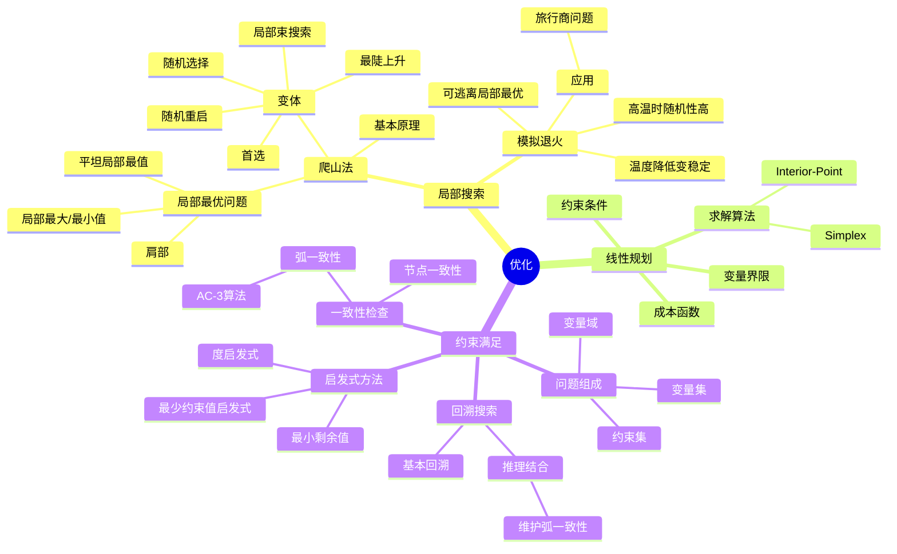

# 优化与搜索算法总结

优化是从一组可能的选项中选择最佳选项的过程。本文档主要介绍了三种优化方法：局部搜索、线性规划和约束满足。

## 局部搜索

局部搜索算法维护单个节点，通过移动到相邻节点来进行搜索，寻找问题的最佳答案而非最快路径。它通常给出"足够好"而非最优的答案，以节省计算资源。

主要局部搜索算法包括：

1. **爬山法**
   - 比较邻近状态与当前状态，选择更好的状态
   - 容易陷入局部最优解（局部最大/最小值）
   - 变体包括：最陡上升、随机选择、首选、随机重启、局部束搜索

2. **模拟退火**
   - 允许算法在一定概率下接受更差的状态
   - 初期高温时更随机，随温度降低变得更"坚定"
   - 能够逃离局部最优解
   - 适用于旅行商问题等

## 线性规划

线性规划是优化线性方程的问题，包含：
- 成本函数：需要最小化的目标函数
- 约束条件：变量总和的限制
- 单个界限：变量范围的限制

求解算法包括Simplex和Interior-Point等。

## 约束满足

约束满足问题需要为变量分配值并同时满足特定条件，具有：
- 变量集、每组变量的域、约束集

相关技术：

1. **一致性**
   - 节点一致性：变量域中的值满足一元约束
   - 弧一致性：变量域中的值满足二元约束
   - AC-3算法：实现弧一致性的方法

2. **回溯搜索**
   - 递归尝试分配值，满足约束则继续，否则回溯
   - 可与推理（如弧一致性）结合使用提高效率

3. **启发式方法**
   - 最小剩余值(MRV)：选择域最小的变量
   - 度启发式：选择度数最高的变量
   - 最少约束值启发式：选择约束其他变量最少的值

## 思维导图

这些优化方法各有特点，适用于不同类型的问题。局部搜索适合大规模问题的近似解，线性规划适用于线性约束条件下的优化，约束满足问题则适合有明确约束的变量分配问题。通过合理选择和组合这些方法，可以高效解决各种优化问题。