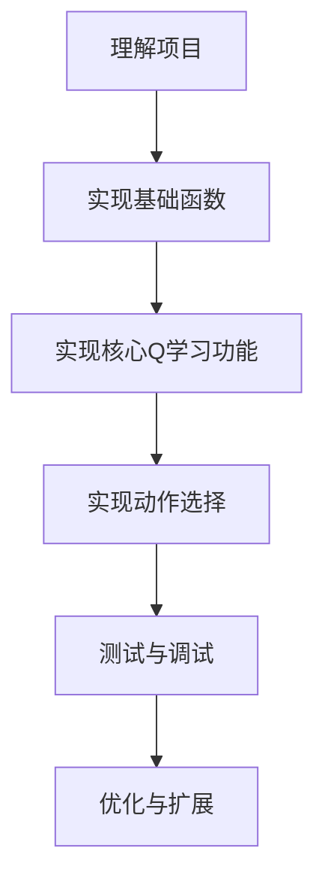

# Nim游戏强化学习AI项目分析

## 1. 项目主要目标
开发一个能够通过强化学习（Q-learning）自学玩Nim游戏的AI。AI将通过反复与自己对弈并从经验中学习，逐渐掌握游戏的最优策略。

## 2. 核心要求和功能点
- 实现 `get_q_value(state, action)` 函数 - 返回特定状态和动作对的Q值
- 实现 `update_q_value(state, action, old_q, reward, future_rewards)` 函数 - 根据Q-learning公式更新Q值
- 实现 `best_future_reward(state)` 函数 - 计算给定状态下最佳可能的未来奖励
- 实现 `choose_action(state, epsilon)` 函数 - 根据当前状态选择一个动作（贪婪或epsilon-贪婪算法）

## 3. 限制条件
- 只能修改需要实现的四个函数，不应修改其他代码
- 可以导入Python标准库模块
- 允许导入numpy或pandas（如果熟悉）
- 禁止使用其他任何第三方Python模块
- 需要使用Q-learning算法进行强化学习

## 4. 类的作用与解释

### Nim类
**作用**：定义Nim游戏规则和游戏状态
- **属性**：
  - `piles`：列表，表示每个堆的物体数量（如[1, 3, 5, 7]）
  - `player`：整数（0或1），表示当前玩家
  - `winner`：None/0/1，表示游戏赢家
- **方法**：
  - `available_actions(piles)`：返回所有可能的动作，如对状态[2,1,0,0]返回{(0,1), (0,2), (1,1)}
  - `move(action)`：执行动作并更新游戏状态
  - `switch_player()`：切换当前玩家

### NimAI类
**作用**：实现Q-learning算法，学习Nim游戏最优策略
- **属性**：
  - `q`：字典，存储(状态,动作)对应的Q值，如{((0,0,0,2), (3,2)): -1}
  - `alpha`：学习率，控制新信息的权重
  - `epsilon`：探索率，控制随机探索概率
- **方法**：
  - 需要实现的四个方法（见核心要求）
  - `update(old_state, action, new_state, reward)`：更新Q-learning模型

## 5. 关键CS概念和技术
- **强化学习**：使用Q-learning算法学习最优策略
- **贪婪/Epsilon-贪婪算法**：平衡探索与利用
- **状态表示**：如何有效表示和存储Nim游戏状态
- **动态规划**：Q-learning本质上是一种动态规划
- **字典数据结构**：用于存储和检索Q值
- **博弈论**：理解Nim游戏的零和博弈性质
- **元组与列表的转换**：状态在使用时需要进行元组转换
- **概率与随机选择**：用于实现epsilon-贪婪策略

---

# Nim 项目实施计划

## 项目总体分解

我将把这个Q学习Nim游戏AI项目分解为以下几个阶段和任务：



## 实施步骤与顺序

### 阶段1：理解项目与准备工作
**任务1.1：熟悉代码框架和游戏规则**
- **目标**：全面理解Nim游戏规则、Q学习机制和现有代码框架
- **输入**：项目说明和现有代码
- **输出**：对项目的清晰理解和实现计划
- **知识点**：Q学习基础、强化学习原理、Nim游戏规则

**任务1.2：准备开发环境**
- **目标**：设置开发环境，准备测试机制
- **输入**：项目代码
- **输出**：可运行的初始代码框架
- **知识点**：Python开发环境

### 阶段2：实现基础函数
**任务2.1：实现`get_q_value`函数**（从这个开始，因为其他函数依赖它）
- **目标**：正确获取状态-动作对的Q值
- **输入**：状态列表`state`和动作元组`action`
- **输出**：对应的Q值，如果不存在则为0
- **知识点**：Python字典操作、元组转换

```python
def get_q_value(self, state, action):
    # 将state转换为元组（因为列表不能作为字典键）
    # 检查(state_tuple, action)是否存在于self.q中
    # 返回相应的值或默认值0
```

### 阶段3：实现核心Q学习功能
**任务3.1：实现`update_q_value`函数**（先做这个因为它是Q学习的核心公式实现）
- **目标**：根据Q学习公式更新Q值
- **输入**：状态`state`、动作`action`、旧Q值`old_q`、奖励`reward`和未来奖励`future_rewards`
- **输出**：更新后的Q值（存储在`self.q`中）
- **知识点**：Q学习更新公式、Python字典更新

```python
def update_q_value(self, state, action, old_q, reward, future_rewards):
    # 计算新价值估计 = reward + future_rewards
    # 应用Q学习公式更新Q值
    # 将更新后的Q值存储在self.q中
```

**任务3.2：实现`best_future_reward`函数**
- **目标**：找出给定状态下最佳可能的奖励值
- **输入**：状态`state`
- **输出**：该状态下所有可用动作的最大Q值
- **知识点**：Python集合操作、最大值查找、Nim游戏可用动作

```python
def best_future_reward(self, state):
    # 获取该状态下所有可用动作
    # 找出所有(state, action)对的最大Q值
    # 如果没有可用动作或所有Q值为0，返回0
```

### 阶段4：实现动作选择
**任务4.1：实现`choose_action`函数**
- **目标**：根据策略（贪婪或epsilon-贪婪）选择动作
- **输入**：状态`state`和布尔标志`epsilon`
- **输出**：选择的动作`(i, j)`
- **知识点**：贪婪算法、epsilon-贪婪算法、随机选择、Python随机模块

```python
def choose_action(self, state, epsilon=True):
    # 获取可用动作集合
    # 根据epsilon参数决定使用贪婪还是epsilon-贪婪策略
    # 返回选择的动作
```

### 阶段5：测试与调试
**任务5.1：单元测试各个函数**
- **目标**：确保每个函数按预期工作
- **输入**：各函数的测试用例
- **输出**：测试结果和修复的错误
- **知识点**：Python调试技巧、单元测试

**任务5.2：集成测试AI训练过程**
- **目标**：验证AI能够学习并改进
- **输入**：完整实现的NimAI类
- **输出**：经过训练的AI模型
- **知识点**：调试长运行程序

### 阶段6：优化与扩展（可选）
**任务6.1：优化训练性能**
- **目标**：提高训练速度或学习效率
- **知识点**：Python性能优化

**任务6.2：实验不同的超参数**
- **目标**：测试不同的alpha和epsilon值对性能的影响
- **知识点**：超参数调优

## 推荐完成顺序与原因

1. **先做`get_q_value`**：这是最基础的函数，其他函数都依赖它获取Q值。它也是最简单的，实现起来相对直接。

2. **再做`update_q_value`**：这是Q学习的核心公式实现，相对独立，一旦理解了公式就能实现。

3. **然后做`best_future_reward`**：这个函数依赖`get_q_value`，需要遍历所有可能的动作获取Q值。

4. **最后做`choose_action`**：它依赖`get_q_value`和可用动作的计算，也是功能最复杂的部分，因为包含贪婪和epsilon-贪婪两种策略。

## 关键里程碑

1. **里程碑1：实现`get_q_value`和`update_q_value`**
   - 验证：能够正确存储和获取Q值
   
2. **里程碑2：实现`best_future_reward`**
   - 验证：能够正确计算最佳未来奖励

3. **里程碑3：实现`choose_action`**
   - 验证：能够根据策略选择动作

4. **里程碑4：完整训练Nim AI（10,000场游戏）**
   - 验证：AI能学会玩游戏并表现出合理策略

5. **里程碑5：与训练好的AI进行人机对战**
   - 验证：AI的策略是否有效

## 需要复习/学习的关键知识点

1. **Q学习基础**：
   - 理解状态、动作、奖励的概念
   - Q值更新公式及其含义

2. **Python数据结构**：
   - 字典操作（特别是使用元组作为键）
   - 列表与元组的转换
   - 集合操作

3. **强化学习策略**：
   - 贪婪算法 vs epsilon-贪婪算法
   - 探索与利用的平衡

4. **Python随机模块**：
   - 用于epsilon-贪婪的随机选择

5. **调试技巧**：
   - 针对强化学习的特殊调试方法
   - 观察Q值变化的方法

每完成一个里程碑，建议回顾代码并确保理解它是如何工作的，这将有助于整体理解Q学习算法的实际应用。### 阶段5：测试与调试
