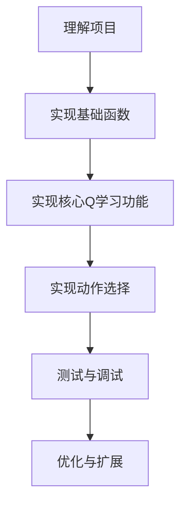
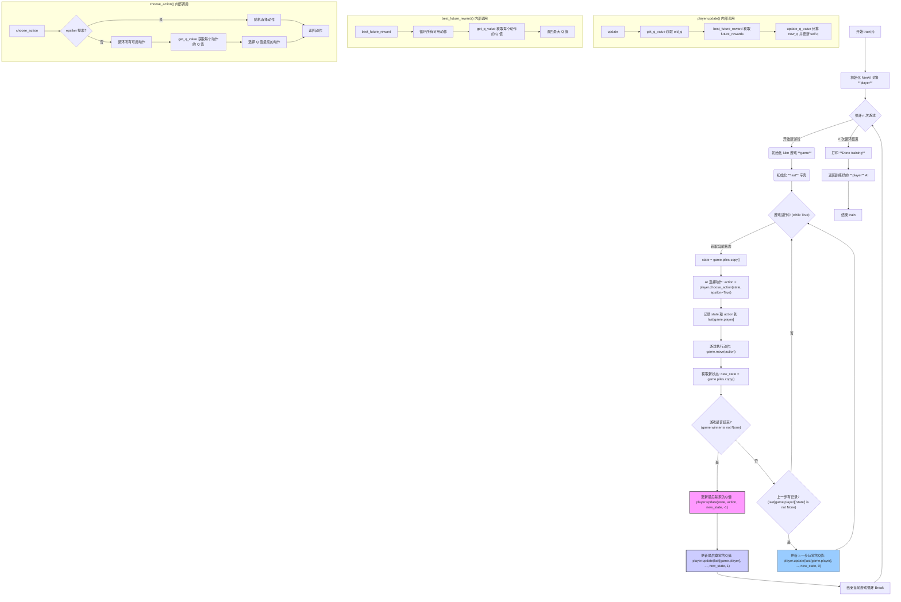

# Nim游戏强化学习AI项目分析

## 1. 项目主要目标
开发一个能够通过强化学习（Q-learning）自学玩Nim游戏的AI。AI将通过反复与自己对弈并从经验中学习，逐渐掌握游戏的最优策略。

## 2. 核心要求和功能点
- 实现 `get_q_value(state, action)` 函数 - 返回特定状态和动作对的Q值
- 实现 `update_q_value(state, action, old_q, reward, future_rewards)` 函数 - 根据Q-learning公式更新Q值
- 实现 `best_future_reward(state)` 函数 - 计算给定状态下最佳可能的未来奖励
- 实现 `choose_action(state, epsilon)` 函数 - 根据当前状态选择一个动作（贪婪或epsilon-贪婪算法）

## 3. 限制条件
- 只能修改需要实现的四个函数，不应修改其他代码
- 可以导入Python标准库模块
- 允许导入numpy或pandas（如果熟悉）
- 禁止使用其他任何第三方Python模块
- 需要使用Q-learning算法进行强化学习

## 4. 类的作用与解释

### Nim类
**作用**：定义Nim游戏规则和游戏状态
- **属性**：
  - `piles`：列表，表示每个堆的物体数量（如[1, 3, 5, 7]）
  - `player`：整数（0或1），表示当前玩家
  - `winner`：None/0/1，表示游戏赢家
- **方法**：
  - `available_actions(piles)`：返回所有可能的动作，如对状态[2,1,0,0]返回{(0,1), (0,2), (1,1)}
  - `move(action)`：执行动作并更新游戏状态
  - `switch_player()`：切换当前玩家

### NimAI类
**作用**：实现Q-learning算法，学习Nim游戏最优策略
- **属性**：
  - `q`：字典，存储(状态,动作)对应的Q值，如{((0,0,0,2), (3,2)): -1}
  - `alpha`：学习率，控制新信息的权重
  - `epsilon`：探索率，控制随机探索概率
- **方法**：
  - 需要实现的四个方法（见核心要求）
  - `update(old_state, action, new_state, reward)`：更新Q-learning模型

## 5. 关键CS概念和技术
- **强化学习**：使用Q-learning算法学习最优策略
- **贪婪/Epsilon-贪婪算法**：平衡探索与利用
- **状态表示**：如何有效表示和存储Nim游戏状态
- **动态规划**：Q-learning本质上是一种动态规划
- **字典数据结构**：用于存储和检索Q值
- **博弈论**：理解Nim游戏的零和博弈性质
- **元组与列表的转换**：状态在使用时需要进行元组转换
- **概率与随机选择**：用于实现epsilon-贪婪策略

---

# Nim 项目实施计划

## 项目总体分解

我将把这个Q学习Nim游戏AI项目分解为以下几个阶段和任务：



## 实施步骤与顺序

### 阶段1：理解项目与准备工作
**任务1.1：熟悉代码框架和游戏规则**
- **目标**：全面理解Nim游戏规则、Q学习机制和现有代码框架
- **输入**：项目说明和现有代码
- **输出**：对项目的清晰理解和实现计划
- **知识点**：Q学习基础、强化学习原理、Nim游戏规则

**任务1.2：准备开发环境**
- **目标**：设置开发环境，准备测试机制
- **输入**：项目代码
- **输出**：可运行的初始代码框架
- **知识点**：Python开发环境

### 阶段2：实现基础函数
**任务2.1：实现`get_q_value`函数**（从这个开始，因为其他函数依赖它）
- **目标**：正确获取状态-动作对的Q值
- **输入**：状态列表`state`和动作元组`action`
- **输出**：对应的Q值，如果不存在则为0
- **知识点**：Python字典操作、元组转换

```python
def get_q_value(self, state, action):
    # 将state转换为元组（因为列表不能作为字典键）
    # 检查(state_tuple, action)是否存在于self.q中
    # 返回相应的值或默认值0
```

### 阶段3：实现核心Q学习功能
**任务3.1：实现`update_q_value`函数**（先做这个因为它是Q学习的核心公式实现）
- **目标**：根据Q学习公式更新Q值
- **输入**：状态`state`、动作`action`、旧Q值`old_q`、奖励`reward`和未来奖励`future_rewards`
- **输出**：更新后的Q值（存储在`self.q`中）
- **知识点**：Q学习更新公式、Python字典更新

```python
def update_q_value(self, state, action, old_q, reward, future_rewards):
    # 计算新价值估计 = reward + future_rewards
    # 应用Q学习公式更新Q值
    # 将更新后的Q值存储在self.q中
```

**任务3.2：实现`best_future_reward`函数**
- **目标**：找出给定状态下最佳可能的奖励值
- **输入**：状态`state`
- **输出**：该状态下所有可用动作的最大Q值
- **知识点**：Python集合操作、最大值查找、Nim游戏可用动作

```python
def best_future_reward(self, state):
    # 获取该状态下所有可用动作
    # 找出所有(state, action)对的最大Q值
    # 如果没有可用动作或所有Q值为0，返回0
```

### 阶段4：实现动作选择
**任务4.1：实现`choose_action`函数**
- **目标**：根据策略（贪婪或epsilon-贪婪）选择动作
- **输入**：状态`state`和布尔标志`epsilon`
- **输出**：选择的动作`(i, j)`
- **知识点**：贪婪算法、epsilon-贪婪算法、随机选择、Python随机模块

```python
def choose_action(self, state, epsilon=True):
    # 获取可用动作集合
    # 根据epsilon参数决定使用贪婪还是epsilon-贪婪策略
    # 返回选择的动作
```

### 阶段5：测试与调试
**任务5.1：单元测试各个函数**
- **目标**：确保每个函数按预期工作
- **输入**：各函数的测试用例
- **输出**：测试结果和修复的错误
- **知识点**：Python调试技巧、单元测试

**任务5.2：集成测试AI训练过程**
- **目标**：验证AI能够学习并改进
- **输入**：完整实现的NimAI类
- **输出**：经过训练的AI模型
- **知识点**：调试长运行程序

### 阶段6：优化与扩展（可选）
**任务6.1：优化训练性能**
- **目标**：提高训练速度或学习效率
- **知识点**：Python性能优化

**任务6.2：实验不同的超参数**
- **目标**：测试不同的alpha和epsilon值对性能的影响
- **知识点**：超参数调优

## 推荐完成顺序与原因

1. **先做`get_q_value`**：这是最基础的函数，其他函数都依赖它获取Q值。它也是最简单的，实现起来相对直接。

2. **再做`update_q_value`**：这是Q学习的核心公式实现，相对独立，一旦理解了公式就能实现。

3. **然后做`best_future_reward`**：这个函数依赖`get_q_value`，需要遍历所有可能的动作获取Q值。

4. **最后做`choose_action`**：它依赖`get_q_value`和可用动作的计算，也是功能最复杂的部分，因为包含贪婪和epsilon-贪婪两种策略。

## 关键里程碑

1. **里程碑1：实现`get_q_value`和`update_q_value`**
   - 验证：能够正确存储和获取Q值
   
2. **里程碑2：实现`best_future_reward`**
   - 验证：能够正确计算最佳未来奖励

3. **里程碑3：实现`choose_action`**
   - 验证：能够根据策略选择动作

4. **里程碑4：完整训练Nim AI（10,000场游戏）**
   - 验证：AI能学会玩游戏并表现出合理策略

5. **里程碑5：与训练好的AI进行人机对战**
   - 验证：AI的策略是否有效

## 需要复习/学习的关键知识点

1. **Q学习基础**：
   - 理解状态、动作、奖励的概念
   - Q值更新公式及其含义

2. **Python数据结构**：
   - 字典操作（特别是使用元组作为键）
   - 列表与元组的转换
   - 集合操作

3. **强化学习策略**：
   - 贪婪算法 vs epsilon-贪婪算法
   - 探索与利用的平衡

4. **Python随机模块**：
   - 用于epsilon-贪婪的随机选择

5. **调试技巧**：
   - 针对强化学习的特殊调试方法
   - 观察Q值变化的方法

每完成一个里程碑，建议回顾代码并确保理解它是如何工作的，这将有助于整体理解Q学习算法的实际应用。### 阶段5：测试与调试

---

**1. `update_q_value` 的目标是什么？**

这个函数的目标是**逐步优化我们对“在某个特定状态下，执行某个特定动作有多好”的估计**。这个“好”的程度就是 Q 值（Q-value），代表了从该状态执行该动作开始，一直到游戏结束所能获得的**长期累积奖励**的期望值。

**2. 公式拆解与变量含义**

```python
# Q(s, a) <- Q(s, a) + alpha * (reward + future_rewards - Q(s, a))
new_q = old_q + self.alpha * (reward + future_rewards - old_q)
```

*   **`old_q` (`Q(s, a)`)**: 这是我们**当前**对“在状态 `state` 下执行动作 `action`”有多好的估计值。它来自我们之前学习到的经验（存储在 `self.q` 字典中）。
*   **`self.alpha`**: **学习率 (Learning Rate)**。它控制了我们每次更新时，新信息（括号里的部分）对旧估计 (`old_q`) 的影响程度。
    *   `alpha` 接近 0：AI 非常保守，不太愿意根据新经验改变旧看法。
    *   `alpha` 接近 1：AI 非常激进，几乎完全用新经验覆盖旧看法。
    *   通常取 0 到 1 之间的小值（比如 0.1, 0.5），在稳定性和学习速度间取得平衡。
*   **`reward`**: **即时奖励 (Immediate Reward)**。这是在状态 `state` 执行动作 `action` 后，**立刻**获得的奖励。在 Nim 项目中：
    *   执行动作后直接导致对方输（自己赢）：+1
    *   执行动作后直接导致自己输：-1
    *   游戏还未结束：0
*   **`future_rewards`**: **对未来最大奖励的估计 (Estimate of Optimal Future Value)**。这代表了执行完当前动作 `action` 到达新状态 `new_state` 后，从那个**新状态**出发，我们**预期**能得到的**最佳**长期累积奖励。这个值是通过 nim.py 函数计算得到的，它会查看新状态下所有可能动作对应的 Q 值，并取出最大值。这是 Q 学习“向前看”的关键。
*   **`reward + future_rewards`**: 这是我们基于**当前这一步**的经验（即时奖励 `reward`）和对**未来**的最佳预期（`future_rewards`）得到的**新的、更优的目标 Q 值估计**。可以理解为“如果我们现在采取这个行动，我们立即得到 `reward`，然后从下一步开始我们预期能得到 `future_rewards` 这么多”。
*   **`(reward + future_rewards - old_q)`**: **时间差分误差 (Temporal Difference Error, TD Error)**。这是“新目标 Q 值估计”和“旧 Q 值估计”之间的差距。它衡量了我们当前的估计 (`old_q`) 与基于新信息的目标值之间的“误差”或“意外程度”。
    *   如果 TD Error > 0：说明实际结果（或预期）比之前想的要好，需要调高 Q 值。
    *   如果 TD Error < 0：说明实际结果（或预期）比之前想的要差，需要调低 Q 值。
*   **`self.alpha * (TD Error)`**: 这是根据学习率调整后的**更新量**。
*   **`new_q`**: **更新后的 Q 值**。我们把旧的估计值 (`old_q`) 加上这个调整后的更新量，得到新的、更接近真实价值的 Q 值估计。

**3. 变量来源**

*   `state`, `action`: 来自于 AI 在游戏中实际执行的上一步操作。
*   `old_q`: 通过 `(get_q_value(state, nim.py ) 从 `self.q` 字典中查询得到。
*   `reward`: 根据游戏规则判断，在执行 `action` 到达 `new_state` 后立即获得。
*   `future_rewards`: 通过 nim.py 计算得到，它会查询 `new_state` 下所有可能动作的 Q 值（同样来自 `self.q`）。
*   `self.alpha`: AI 初始化时设定的超参数。

**4. 为何能逼近正确答案？（运作机制）**

这个公式之所以有效，是因为它利用了**贝尔曼方程 (Bellman Equation)** 的思想和**时间差分学习 (Temporal Difference Learning)** 的方法：

*   **自举 (Bootstrapping)**：它用当前的估计值 `best_future_reward`，也是基于 `self.q` 里的值）来更新自身（`old_q` 也是 `self.q` 里的值）。就像“自己教自己”。
*   **迭代优化**：AI 通过大量玩游戏（训练），反复经历不同的 `(state, action, reward, new_state)` 序列。每一次 `update` 都是一次微小的调整。
*   **价值传播**：奖励信息（尤其是游戏结束时的 +1 或 -1）会通过这个更新公式，从结束状态一步步向前传播到之前的状态和动作。例如，一个导致最终胜利的动作，它的 Q 值会因为后续状态的 `future_rewards` 变高而逐渐增加；反之，导致失败的动作 Q 值会逐渐降低。
*   **收敛性**：在满足一定条件（如所有状态动作对被无限次访问、学习率 `alpha` 合理衰减）下，Q 学习理论上能保证 Q 值收敛到最优值，即精确反映每个状态动作对的长期价值。

**简单来说，AI 通过不断尝试（由 `choose_action` 的 `epsilon` 控制探索），然后根据尝试的结果（`reward`）和对未来的预期（`future_rewards`），利用这个公式不断修正自己对每个（状态，动作）价值的判断，最终学会哪些动作在哪些状态下是“好”的（Q 值高），哪些是“坏”的（Q 值低）。**

---

1.  **`self.q` 首次更新与随机性：**
    *   **首次更新时机**：`self.q` 字典在 `NimAI` 初始化时是空的。第一次对某个 `(state, action)` 对进行更新，发生在 `train` 函数的游戏循环中调用 `player.update()` 时。具体来说：
        *   在一个游戏回合中，AI（比如当前是玩家 0）选择并执行了一个动作 `action`，从 `old_state` 到达 `new_state`。
        *   **关键点**：`update` 函数需要知道这个动作导致的**奖励 `reward`** 和**新状态 `new_state` 下的最佳未来奖励 `future_rewards`**。
        *   对于中间步骤（游戏未结束），奖励是 0。`update` 会在**下一个**玩家（玩家 1）执行完它的动作后，用这个 0 奖励来更新玩家 0 上一步的 Q 值。
        *   对于游戏结束时的最后一步，奖励是 +1（给赢家）或 -1（给输家）。这个更新发生在 `if game.winner is not None:` 分支内。
        *   所以，严格意义上的第一次写入 `self.q` 发生在第一个训练游戏中，当第一个动作完成后、并且其结果（至少是中间结果）被评估时。
    *   **测试（`play` 函数）中的随机性**：在 `play.py` 调用 `play(ai)` 进行人机对战时，调用 `ai.choose_action` 时明确设置了 `epsilon=False`：
        ```python
        # filepath: c:\Users\hkx\OneDrive\桌面\2025Spring\CS50’s Introduction to AI 2024\Lecture4\Project\nim\nim.py
        # ... inside play() function ...
        else:
            print("AI's Turn")
            pile, count = ai.choose_action(game.piles, epsilon=False) # 注意这里是 False
            print(f"AI chose to take {count} from pile {pile}.")
        ```
        这意味着在**与人对战时，AI 总是采取它认为 Q 值最高的动作（贪婪策略），不会进行随机探索**。随机性主要存在于 `train` 函数的训练过程中（因为默认 `epsilon=True`）。

2.  **训练提升与自我对弈：**
    *   **如何提升**：提升的核心在于 Q 学习的**价值迭代**过程。每次 `update_q_value` 被调用时，它都在微调某个 `(state, action)` 对的 Q 值。这个调整基于：
        *   **即时反馈 (`reward`)**：执行这个动作立刻是好是坏（游戏结束时 +1 或 -1，否则为 0）。
        *   **未来预期 (`future_rewards`)**：执行这个动作后到达的新状态有多大的潜力（基于当前对新状态下最佳动作的 Q 值估计）。
        *   **学习率 (`alpha`)**：控制每次调整的幅度。
        通过成千上万次的游戏和更新，Q 值会逐渐从最初的 0（或随机值）**收敛**到更能反映动作长期价值的稳定值。那些经常导向胜利的 `(state, action)` 路径，其 Q 值会逐渐升高；而导向失败的路径，Q 值会逐渐降低。
    *   **自我对弈为何有效**：
        *   **生成经验**：AI 需要大量的 `(state, action, reward, new_state)` 数据来学习。自我对弈是产生这些数据的有效方式。
        *   **学习双方策略**：在 `train` 函数中，`player = NimAI()` 这一个 AI 实例同时扮演玩家 0 和玩家 1。这意味着它既能学习“如何走能赢”，也能学习“对手怎么走会导致我输”。
        *   **奖励信号传播**：当一局游戏结束时，获胜方最后一步的 `(state, action)` 获得 +1 奖励更新，失败方最后一步获得 -1 奖励更新。这个强烈的信号会通过 `future_rewards` 机制，在后续的训练游戏中**反向传播**。例如，如果某个动作 A 导致的状态 S' 最终让对手（也是 AI 自己）输了（即自己赢了），那么 S' 的 `best_future_reward` 会变高（趋向 +1），这会使得导致进入 S' 的动作 A 的 Q 值在更新时也倾向于增加。反之亦然。AI 通过这种方式，逐渐学会避免进入那些最终会导致失败的状态，并倾向于进入那些最终能导向胜利的状态。
        *   **探索机制**：`epsilon`-greedy 策略确保 AI 不会只固守早期发现的“看起来不错”的策略，而是会以一定概率尝试新的、未知的动作，从而可能发现更优的全局策略。

3.  **四个函数在学习过程中的作用：**
    *   **`get_q_value(state, action)`**：**查询员**。在学习的每一步（`update` 函数内部）和做决策时（`choose_action` 函数内部），都需要知道当前对某个 `(state, action)` 的估计值是多少。这个函数负责从 `self.q` 字典中读取这个值，如果没学过就返回 0。
    *   **`update_q_value(state, action, old_q, reward, future_rewards)`**：**学习核心**。这是真正执行 Q 学习公式的地方。它接收旧的估计 `old_q`、即时奖励 `reward` 和对未来的估计 `future_rewards`，计算出新的 Q 值 `new_q`，并将其**写入** `self.q` 字典，完成一次学习更新。它只在 `update` 函数中被调用。
    *   **`best_future_reward(state)`**：**未来评估员**。在计算 Q 值更新的目标时（`update` 函数内部），需要知道“如果我到达了 `new_state`，那么从那个新状态出发，最好的长期收益期望是多少？”。这个函数通过查看 `new_state` 下所有可能的动作，并使用 `get_q_value` 查询它们当前的 Q 值，然后返回其中最大的那个值，作为对未来的估计。
    *   **`choose_action(state, epsilon=True)`**：**决策者**。在 `train` 函数的每个回合，AI 需要决定走哪一步。这个函数根据 `epsilon` 的值来决定：
        *   以 `epsilon` 的概率随机选择一个可用动作（**探索 Exploration**）。
        *   以 `1-epsilon` 的概率选择当前 Q 值最高的动作（**利用 Exploitation**）。它需要调用 `get_q_value` 来比较不同动作的 Q 值。
        在 `play` 函数中，它只进行利用（`epsilon=False`）。

4.  **训练过程流程图:**



这个流程图展示了 `train` 函数如何通过多局自我对弈来训练 AI。关键在于内部的游戏循环，以及在游戏结束或进行中时调用 `player.update` 来学习。`update` 函数内部则协调调用了你实现的 `get_q_value`, `best_future_reward`, 和 `update_q_value` 来完成一次学习迭代。`choose_action` 则在每一步决定 AI 的行为。