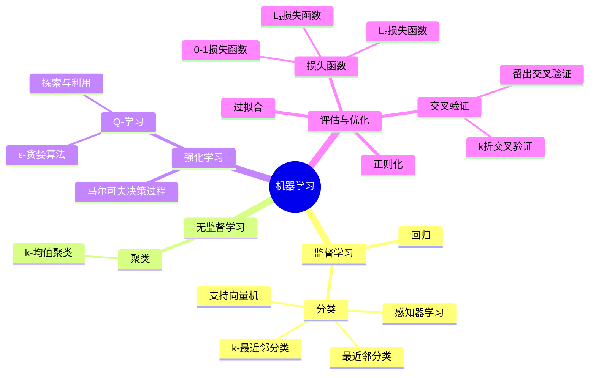

# 机器学习知识总结

机器学习是通过提供数据而非明确指令，使计算机能够学习识别模式并自行执行任务的方法。

## 主要类型与概念

### 监督学习
- **分类**：将输入映射到离散输出的任务
  - **最近邻分类**：根据最近观察点的值分类
  - **k-最近邻分类**：基于k个最近邻居中最常见的类别进行分类
  - **感知器学习**：创建决策边界，通过线性函数区分类别
  - **支持向量机**：使用决策边界和支持向量做出最佳分隔决策
- **回归**：将输入映射到连续值的任务

### 无监督学习
- **聚类**：将相似的数据组织成组
  - **k-均值聚类**：随机放置k个聚类中心，迭代优化聚类

### 强化学习
- **马尔可夫决策过程**：通过状态、动作、转移模型和奖励函数来建模
- **Q-学习**：通过函数Q(s,a)估计在状态s中采取行动a的价值
- **探索与利用权衡**：平衡尝试新路径与使用已知有效路径
- **ε-贪婪算法**：在概率为ε时随机移动(探索)，其他时候选择最佳移动(利用)

### 评估与优化
- **损失函数**：量化预测的不准确程度
  - **0-1损失函数**：分类问题中的正确/错误评估
  - **L₁损失函数**：观察值与预测值的绝对差异
  - **L₂损失函数**：观察值与预测值的平方差异
- **过拟合**：模型过于适应训练数据而无法泛化
- **正则化**：惩罚复杂假设以支持更简单的假设
- **交叉验证**：评估模型泛化能力
  - **留出交叉验证**：将数据分为训练集和测试集
  - **k折交叉验证**：将数据分为k个集合，轮流作为测试集

## 知识关系图
