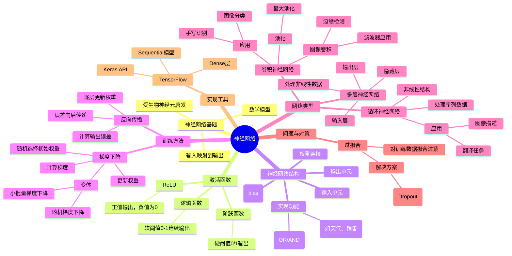

# 神经网络知识总结

神经网络是一种受生物神经网络启发的数学学习模型，通过将输入通过层次化的结构映射到输出，能够从数据中学习模式和关系。

## 知识要点总结

- **神经网络基础**：由输入单元、带权重的连接以及输出单元组成，通过对输入加权求和并加上偏置来处理数据
- **激活函数**：包括阶跃函数(硬阈值)、逻辑函数(软阈值)和ReLU(整流线性单元)，它们决定神经元何时激活
- **训练方法**：主要使用梯度下降算法和反向传播来最小化损失并更新权重
- **网络结构**：从简单感知器到多层神经网络，增加隐藏层可以处理非线性数据
- **特殊类型网络**：卷积神经网络(CNN)处理图像，循环神经网络(RNN)处理序列数据
- **优化技术**：如dropout技术防止过拟合

## 思维导图

这个思维导图展示了神经网络的核心概念及其相互关系，从基础原理到训练方法，以及特殊类型的神经网络结构和应用场景。