# CS50 人工智能 - Lecture 5 笔记

来源: https://cs50.harvard.edu/ai/2024/notes/5/

## 第五讲

### 神经网络

人工智能神经网络的灵感来自神经科学。在大脑中，神经元是相互连接形成网络的细胞。每个神经元都能接收和发送电信号。一旦神经元接收到的电输入超过某个阈值，神经元就会激活，从而向前发送其电信号。

人工神经网络是一种受生物神经网络启发的数学学习模型。人工神经网络根据网络的结构和参数，将输入映射到输出的数学函数进行建模。在人工神经网络中，网络的结构是通过对数据的训练而形成的。

在人工智能中实现时，每个神经元的对应物是一个与其他单元相连的单元。例如，像上一讲一样，人工智能可能会将两个输入 x₁ 和 x₂ 映射到今天是否会下雨。上一讲中，我们建议此假设函数采用以下形式：h(x₁, x₂) = w₀ + w₁x₁ + w₂x₂，其中 w₁ 和 w₂ 是修改输入的权重，w₀ 是常数，也称为偏置，用于修改整个表达式的值。

### 激活函数

要使用假设函数来决定是否下雨，我们需要根据它产生的值创建某种阈值。

实现这一点的一种方法是使用阶跃函数，该函数在达到特定阈值之前给出 0，达到阈值后给出 1。

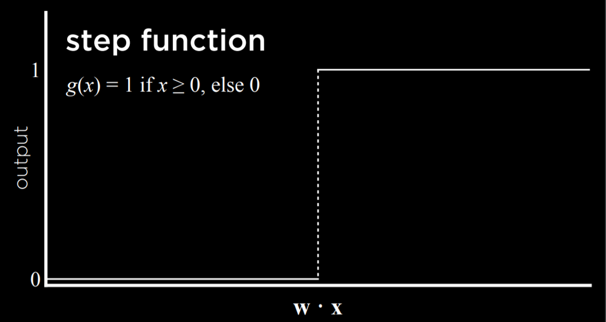

另一种方法是使用逻辑函数，它给出从 0 到 1 的任何实数作为输出，从而表达对其判断的分级置信度。

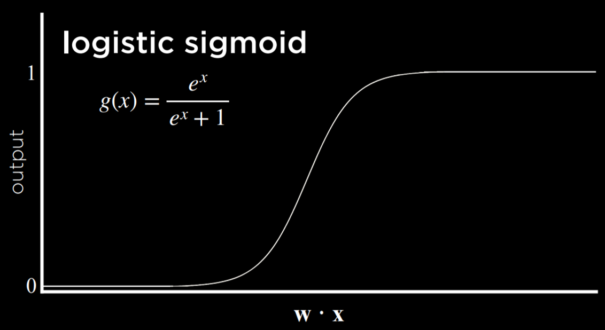

另一种可能的函数是整流线性单元（ReLU），它允许输出为任何正值。如果值为负，ReLU 将其设置为 0。

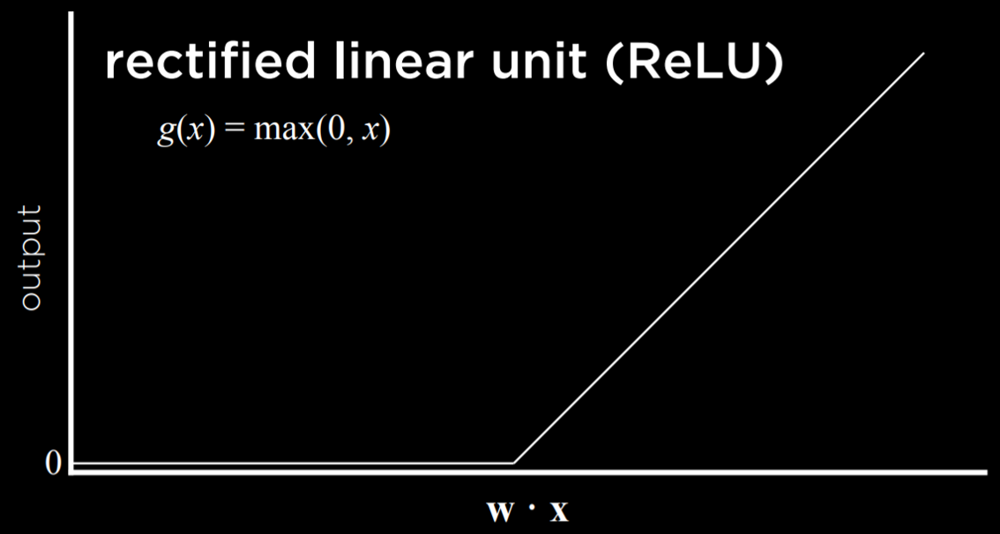

无论我们选择使用哪种函数，我们在上一讲中了解到输入会被权重修改并加上偏置，然后这些的总和会传递给激活函数。这在简单的神经网络中依然适用。

### 神经网络结构

神经网络可以被认为是上述概念的表示，其中一个函数将输入求和以产生输出。

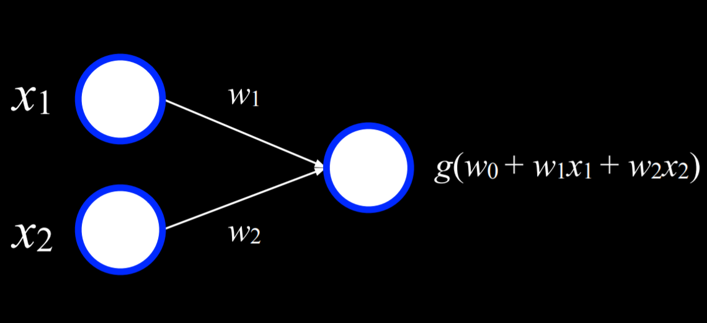

左侧的两个白色单元是输入，右侧的单元是输出。输入通过带权重的边与输出相连。为了做出决策，输出单元将输入乘以权重并加上偏置(w₀)，然后使用函数g来确定输出。

例如，一个逻辑或连接可以表示为函数f，其真值表如下：
| x | y | f(x, y) |
|---|---|--------|
| 0 | 0 |   0    |
| 0 | 1 |   1    |
| 1 | 0 |   1    |
| 1 | 1 |   1    |

我们可以将此函数可视化为神经网络。x₁是一个输入单元，x₂是另一个输入单元。它们通过权重为1的边连接到输出单元。然后，输出单元使用函数g(-1 + 1x₁ + 2x₂)，阈值为0，输出0或1(假或真)。
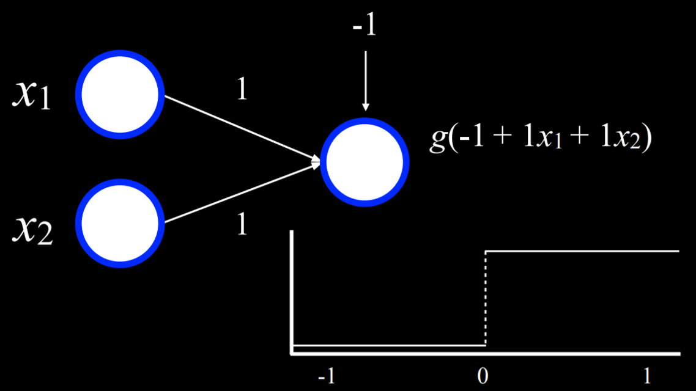
例如，当x₁ = x₂ = 0时，总和为(-1)。这低于阈值，所以函数g将输出0。但是，如果x₁或x₂中的任一个或两者都等于1，那么所有输入的总和将是0或1。两者都达到或超过阈值，因此函数将输出1。

类似的过程可以用于与函数(其中偏置将是(-2))。此外，输入和输出不必是不同的。类似的过程可以用于将湿度和气压作为输入，并产生下雨的概率作为输出。或者，在不同的例子中，输入可以是花在广告上的钱和花费的月份，输出是销售的预期收入。这可以扩展到任意数量的输入，方法是将每个输入x₁…xₙ乘以权重w₁…wₙ，对结果值求和并加上偏置w₀。


### 梯度下降

梯度下降是训练神经网络时用于最小化损失的算法。正如前面提到的，神经网络能够从数据中推断出关于网络结构本身的知识。到目前为止，我们定义了不同的权重，而神经网络允许我们根据训练数据计算这些权重。为此，我们使用梯度下降算法，该算法的工作方式如下：

- 从随机选择的权重开始。这是我们的天真起点，我们不知道应该如何为每个输入加权。
- 重复：

  - 基于所有将导致损失减少的数据点计算梯度。最终，梯度是一个向量（数字序列）。
  - 根据梯度更新权重。

- 计算梯度，基于所有将导致损失减少的数据点。最终，梯度是一个向量（数字序列）。
- 根据梯度更新权重。

- 计算梯度，基于所有将导致损失减少的数据点。最终，梯度是一个向量（数字序列）。
- 根据梯度更新权重。

这个问题在于，这种算法需要根据所有数据点计算梯度，这在计算上是昂贵的。有多种方法可以最小化这种成本。例如，在随机梯度下降中，梯度是根据随机选择的一个点计算的。这种梯度可能非常不准确，这导致了小批量梯度下降算法的出现，该算法根据随机选择的几个点计算梯度，从而在计算成本和准确性之间找到折衷方案。和往常一样，这些解决方案都不是完美的，并且在不同的情况下可能会采用不同的解决方案。

使用梯度下降，可以找到许多问题的答案。例如，我们可能想知道的不仅仅是“今天会下雨吗？”我们可以使用一些输入来生成不同类型天气的概率，然后只选择最有可能的天气。

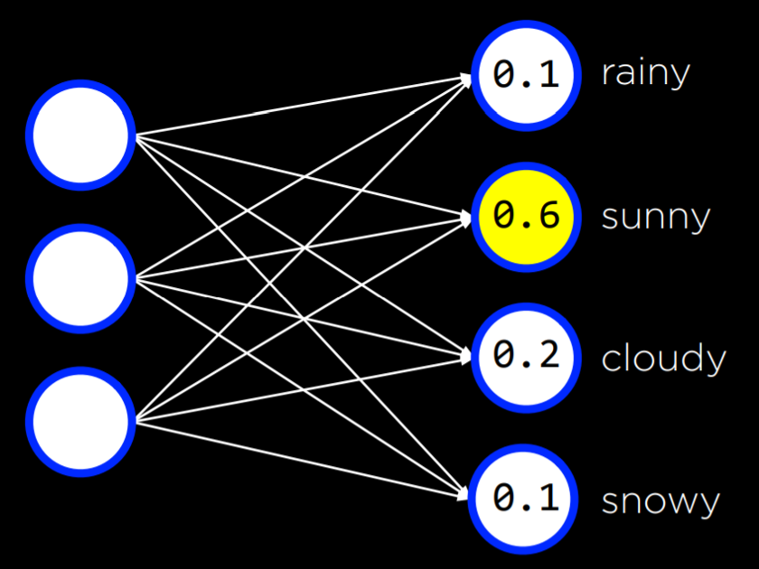

这可以用任意数量的输入和输出来完成，其中每个输入都连接到每个输出，并且输出代表我们可以做出的决定。请注意，在这种神经网络中，输出是不连接的。这意味着每个输出及其来自所有输入的相关权重可以被视为一个单独的神经网络，因此可以与其他输出分开训练。

到目前为止，我们的神经网络依赖于感知器输出单元。这些是只能学习线性决策边界的单元，使用直线来分隔数据。也就是说，基于线性方程，感知器可以对输入进行分类，使其成为一种或另一种类型（例如左图）。但是，通常，数据不是线性可分的（例如右图）。在这种情况下，我们转向多层神经网络来非线性地建模数据。

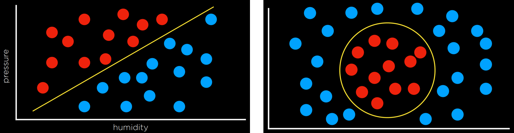

### 多层神经网络

多层神经网络是具有输入层、输出层和至少一个隐藏层的人工神经网络。虽然我们提供输入和输出来训练模型，但我们，人类，不会向隐藏层内的单元提供任何值。第一个隐藏层中的每个单元从输入层的每个单元接收加权值，对其执行某些操作并输出一个值。这些值中的每一个都被加权并进一步传播到下一层，重复此过程直到达到输出层。通过隐藏层，可以对非线性数据进行建模。

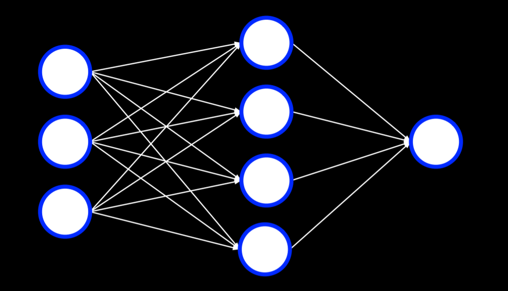

### 反向传播

反向传播是用于训练具有隐藏层的神经网络的主要算法。它通过从输出单元的误差开始，计算上一层权重的梯度下降，并重复此过程直到达到输入层来实现这一点。在伪代码中，我们可以将算法描述如下：

- 计算输出层的误差
- 对于每一层，从输出层开始向最早的隐藏层移动：

  - 将误差向后传播一层。换句话说，当前考虑的层向前一层发送误差。
  - 更新权重。

这可以扩展到任意数量的隐藏层，创建深度神经网络，即具有多个隐藏层的神经网络。

### 过拟合

过拟合是对训练数据建模过于紧密，从而无法推广到新数据。对抗过拟合的一种方法是丢弃（dropout）。在这种技术中，我们在学习阶段临时移除随机选择的单元。这样，我们试图防止过度依赖网络中的任何一个单元。在整个训练过程中，神经网络将采用不同的形式，每次丢弃一些其他单元，然后再次使用它们：

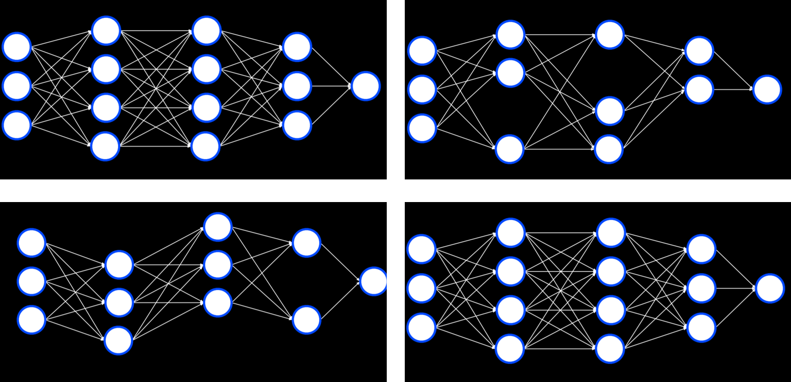

请注意，训练完成后，将再次使用整个神经网络。

### TensorFlow

与 Python 中经常出现的情况一样，有多个库已经实现了使用反向传播算法的神经网络，TensorFlow 就是这样一个库。欢迎您在这个 Web 应用程序中尝试 TensorFlow 神经网络，该应用程序允许您定义网络的不同属性并运行它，可视化输出。我们现在将转向一个例子，说明我们如何使用 TensorFlow 执行我们在上一讲中讨论的任务：区分伪造钞票和真钞。

```python
import csv
import tensorflow as tf
from sklearn.model_selection import train_test_split
```

我们导入 TensorFlow 并将其称为 tf（以使代码更短）。

```python
# 从文件中读取数据
with open("banknotes.csv") as f:
    reader = csv.reader(f)
    next(reader)

    data = []
    for row in reader:
        data.append({
            "evidence": [float(cell) for cell in row[:4]],
            "label": 1 if row[4] == "0" else 0
        })

# 将数据分为训练组和测试组
evidence = [row["evidence"] for row in data]
labels = [row["label"] for row in data]
X_training, X_testing, y_training, y_testing = train_test_split(
    evidence, labels, test_size=0.4
)
```

我们将 CSV 数据提供给模型。我们的工作通常需要使数据适合库要求的格式。实际编码模型的困难部分已经为我们实现了。

```python
# 创建一个神经网络
model = tf.keras.models.Sequential()
```

Keras 是不同机器学习算法访问的 API。顺序模型是各层彼此跟随的模型（就像我们到目前为止看到的那样）。

```python
# 添加一个具有 8 个单元的隐藏层，使用 ReLU 激活
model.add(tf.keras.layers.Dense(8, input_shape=(4,), activation="relu"))
```

密集层是当前层中的每个节点都连接到前一层中的所有节点的层。在生成我们的隐藏层时，我们创建了 8 个密集层，每个层有 4 个输入神经元，使用上面提到的 ReLU 激活函数。

```python
# 添加具有 1 个单元的输出层，使用 sigmoid 激活
model.add(tf.keras.layers.Dense(1, activation="sigmoid"))
```

在我们的输出层中，我们希望创建一个使用 sigmoid 激活函数的密集层，sigmoid 激活函数是输出介于 0 和 1 之间的值。

```python
# 训练神经网络
model.compile(
    optimizer="adam",
    loss="binary_crossentropy",
    metrics=["accuracy"]
)
model.fit(X_training, y_training, epochs=20)
```

最后，我们编译模型，指定应该使用哪个算法来优化它，我们使用哪种类型的损失函数，以及我们希望如何衡量它的成功（在我们的例子中，我们对输出的准确性感兴趣）。最后，我们使用 20 次重复（epochs）在训练数据上拟合模型，然后在测试数据上对其进行评估。

```python
# 评估模型表现
model.evaluate(X_testing, y_testing, verbose=2)
```

由于模型需要时间进行训练，我们可以保存已经训练好的模型以供以后使用。

```python
# 将模型保存到文件
if len(sys.argv) == 2:
    filename = sys.argv[1]
    model.save(filename)
    print(f"Model saved to {filename}.")
```

现在，如果我们运行一个接收手绘数字作为输入的程序，它将能够使用该模型对数字进行分类和输出。有关此类程序的实现，请参阅本讲义的源代码中的 recognition.py。

## 计算机视觉

计算机视觉包括用于分析和理解数字图像的不同计算方法，并且通常使用神经网络来实现。例如，当社交媒体使用面部识别来自动标记图片中的人物时，就会使用计算机视觉。其他例子包括手写识别和自动驾驶汽车。

图像由像素组成，像素由三个值表示，这三个值的范围从 0 到 255，一个用于红色，一个用于绿色，一个用于蓝色。这些值通常用首字母缩写词 RGB 来指代。我们可以使用它来创建一个神经网络，其中每个像素中的每个颜色值都是一个输入，我们有一些隐藏层，输出是一些单元，这些单元告诉我们图像中显示的内容。但是，这种方法存在一些缺点。首先，通过将图像分解为像素及其颜色的值，我们无法使用图像的结构作为辅助。也就是说，作为人类，如果我们看到脸的一部分，我们知道会看到脸的其余部分，这会加快计算速度。我们希望能够在我们的神经网络中使用类似的优势。其次，输入的数量非常大，这意味着我们将不得不计算大量的权重。

## 图像卷积

图像卷积是应用一个滤波器，该滤波器将图像的每个像素值与其邻居相加，并根据内核矩阵进行加权。这样做会改变图像，并且可以帮助神经网络处理它。

让我们考虑以下示例：

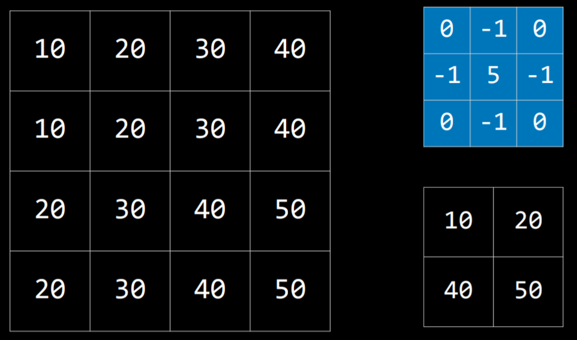

内核是蓝色矩阵，图像是左侧的大矩阵。生成的过滤图像是右下角的小矩阵。要使用内核过滤图像，我们从图像左上角值为 20 的像素（坐标 1,1）开始。然后，我们将它周围的所有值乘以内核中的相应值并将它们相加 (10\*0 + 20\*(-1) + 30\*0 + 10\*(-1) + 20\*5 + 30\*(-1) + 20\*0 + 30\*(-1) + 40\*0)，产生值 10。然后，我们将对右侧的像素 (30)、第一个像素下方的像素 (30) 以及该像素右侧的像素 (40) 执行相同的操作。这会生成一个过滤后的图像，其值显示在右下角。

不同的内核可以完成不同的任务。对于边缘检测，通常使用以下内核：

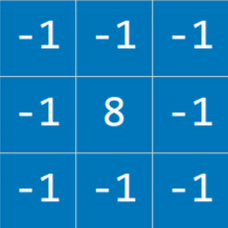

这里的想法是，当像素与其所有邻居相似时，它们应该相互抵消，从而产生值 0。因此，像素越相似，图像的该部分就越暗，而像素差异越大，图像就越亮。将此内核应用于图像（左侧）会产生具有明显边缘的图像（右侧）：


让我们考虑一下图像卷积的实现。我们正在使用 PIL 库（代表 Python 图像库），它可以为我们完成大部分繁重的工作。

```python
import math
import sys

from PIL import Image, ImageFilter

# 确保正确使用
if len(sys.argv) != 2:
    sys.exit("Usage: python filter.py filename")

# 打开图像
image = Image.open(sys.argv[1]).convert("RGB")

# 根据边缘检测内核过滤图像
filtered = image.filter(ImageFilter.Kernel(
    size=(3, 3),
    kernel=[-1, -1, -1, -1, 8, -1, -1, -1, -1],
    scale=1
))

# 显示结果图像
filtered.show()
```

尽管如此，由于用作神经网络输入的像素数量，在神经网络中处理图像在计算上是昂贵的。解决此问题的另一种方法是池化，其中通过从输入中的区域进行采样来减小输入的大小。彼此相邻的像素属于图像中的同一区域，这意味着它们很可能相似。因此，我们可以取一个像素来代表整个区域。实现此目的的一种方法是使用最大池化，其中选择的像素是同一区域中所有其他像素中值最高的像素。例如，如果我们将左侧正方形（如下所示）分成四个 2X2 的正方形，通过从该输入进行最大池化，我们得到右侧的小正方形。

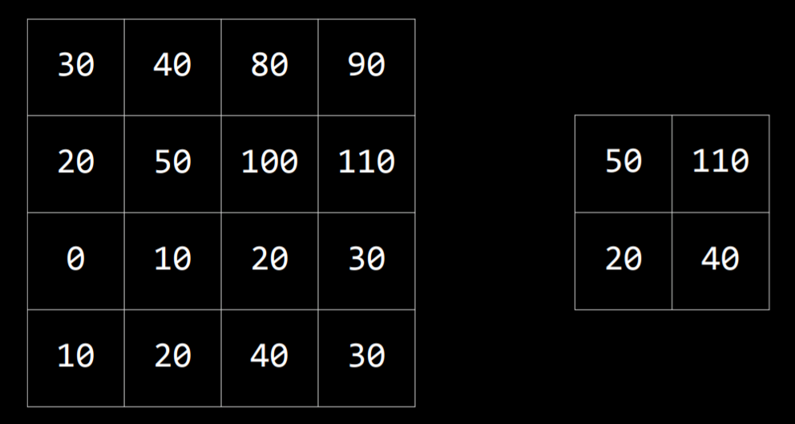

## 卷积神经网络

卷积神经网络是使用卷积的神经网络，通常用于分析图像。它首先应用滤波器，这些滤波器可以使用不同的内核来帮助提取图像的一些特征。这些滤波器可以像神经网络中的其他权重一样得到改进，方法是根据输出的误差调整其内核。然后，将生成的图像池化，之后将像素作为输入提供给传统的神经网络（称为展平的过程）。


卷积和池化步骤可以重复多次，以提取其他特征并减小神经网络的输入大小。这些过程的好处之一是，通过卷积和池化，神经网络对变化的敏感度降低。也就是说，如果从略微不同的角度拍摄同一张图片，卷积神经网络的输入将是相似的，而如果没有卷积和池化，每个图像的输入将大不相同。

在代码中，卷积神经网络与传统神经网络的区别不大。TensorFlow 提供了数据集来测试我们的模型。我们将使用 MNIST，其中包含黑白手写数字的图片。我们将训练我们的卷积神经网络来识别数字。

```python
import sys
import tensorflow as tf

# 使用 MNIST 手写数据集
mnist = tf.keras.datasets.mnist

# 准备训练数据
(x_train, y_train), (x_test, y_test) = mnist.load_data()
x_train, x_test = x_train / 255.0, x_test / 255.0
y_train = tf.keras.utils.to_categorical(y_train)
y_test = tf.keras.utils.to_categorical(y_test)
x_train = x_train.reshape(
    x_train.shape[0], x_train.shape[1], x_train.shape[2], 1
)
x_test = x_test.reshape(
    x_test.shape[0], x_test.shape[1], x_test.shape[2], 1
)

# 创建卷积神经网络
model = tf.keras.models.Sequential([

    # 卷积层。使用 3x3 内核学习 32 个滤波器
    tf.keras.layers.Conv2D(
        32, (3, 3), activation="relu", input_shape=(28, 28, 1)
    ),

    # 最大池化层，使用 2x2 池大小
    tf.keras.layers.MaxPooling2D(pool_size=(2, 2)),

    # 展平单元
    tf.keras.layers.Flatten(),

    # 添加一个带有 dropout 的隐藏层
    tf.keras.layers.Dense(128, activation="relu"),
    tf.keras.layers.Dropout(0.5),

    # 添加一个具有所有 10 个数字的输出单元的输出层
    tf.keras.layers.Dense(10, activation="softmax")
])

# 训练神经网络
model.compile(
    optimizer="adam",
    loss="categorical_crossentropy",
    metrics=["accuracy"]
)
model.fit(x_train, y_train, epochs=10)

# 评估神经网络性能
model.evaluate(x_test,  y_test, verbose=2)
```

由于模型需要时间进行训练，我们可以保存已经训练好的模型以供以后使用。

```python
# 将模型保存到文件
if len(sys.argv) == 2:
    filename = sys.argv[1]
    model.save(filename)
    print(f"Model saved to {filename}.")
```

现在，如果我们运行一个接收手绘数字作为输入的程序，它将能够使用该模型对数字进行分类和输出。有关此类程序的实现，请参阅本讲义的源代码中的 recognition.py。

## 循环神经网络

前馈神经网络是我们之前讨论过的神经网络类型，其中将输入数据提供给网络，该网络最终产生一些输出。下面可以看到前馈神经网络的工作方式的图表。


与此相反，循环神经网络由非线性结构组成，其中网络使用其自己的输出来作为输入。例如，微软的 Captionbot 能够用句子描述图像的内容。这与分类不同，因为输出可以根据图像的属性而变化。虽然前馈神经网络无法改变输出的数量，但循环神经网络能够做到这一点，这要归功于它们的结构。在字幕任务中，网络将处理输入以产生输出，然后从该点继续处理，产生另一个输出，并根据需要重复。

循环神经网络在网络处理序列而不是单个个体对象的情况下很有帮助。上面，神经网络需要产生一个单词序列。但是，相同的原理可以应用于分析视频文件（由一系列图像组成）或翻译任务（其中一系列输入（源语言中的单词）被处理以产生一系列输出（目标语言中的单词））。
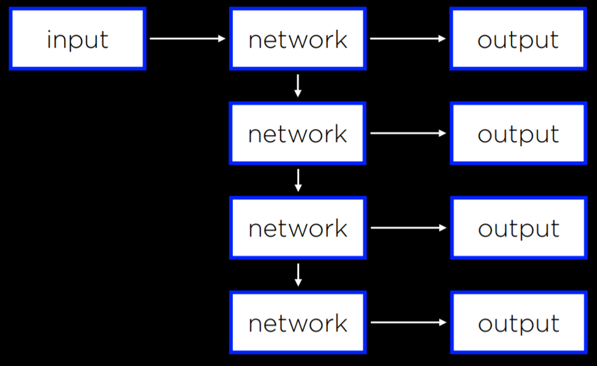