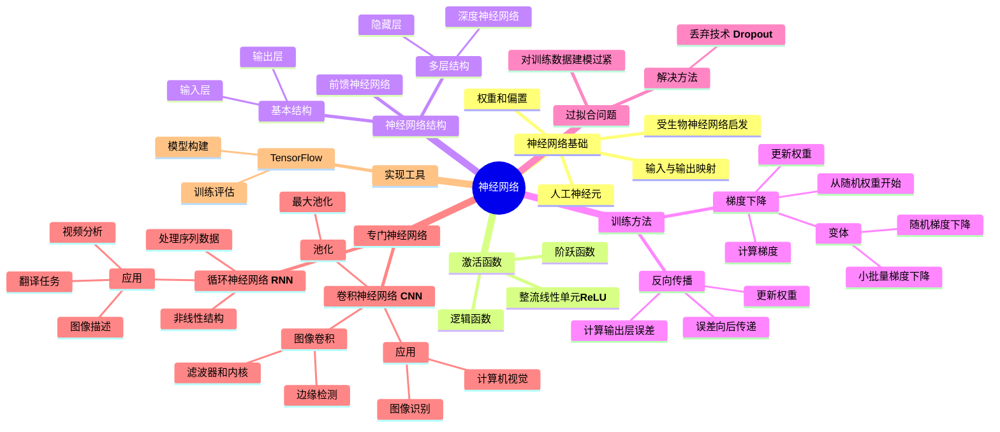
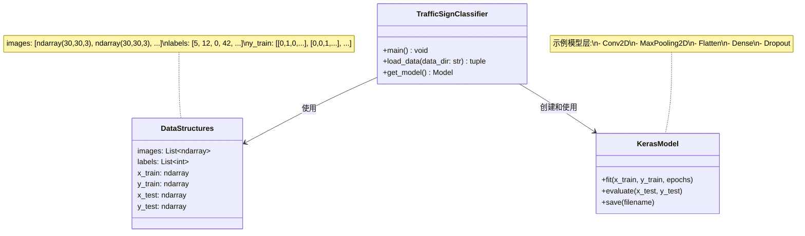

# 神经网络知识总结

神经网络是受生物神经元启发的数学学习模型，通过网络结构和参数将输入映射到输出。

## 主要概念总结

- **神经网络基础**：受生物神经网络启发，由人工神经元(单元)组成，通过权重和偏置处理输入数据
- **激活函数**：决定神经元何时激活，主要包括阶跃函数、逻辑函数和ReLU函数
- **神经网络结构**：包括输入单元、带权重的连接、偏置和输出单元
- **训练方法**：
  - 梯度下降：最小化损失的算法，包括普通梯度下降、随机梯度下降和小批量梯度下降
  - 反向传播：训练隐藏层的算法，从输出误差开始向后计算
- **过拟合问题**：对训练数据建模过于紧密，可通过dropout(随机丢弃单元)技术解决
- **神经网络类型**：
  - 多层神经网络：含隐藏层，能处理非线性数据
  - 卷积神经网络：使用图像卷积和池化处理图像数据
  - 循环神经网络：处理序列数据，输出可作为输入

## 思维导图

---

# 交通标志识别项目分析

## 1. 项目主要目标
构建一个神经网络模型，能够根据图像正确识别和分类43种不同类型的交通标志。

## 2. 核心要求和功能点
- **实现`load_data`函数**:
  - 从指定目录加载图像数据
  - 将图像调整为统一尺寸(`IMG_WIDTH × IMG_HEIGHT`)
  - 返回图像数组和对应标签
- **实现`get_model`函数**:
  - 构建并编译神经网络模型
  - 输入层接受形状为`(IMG_WIDTH, IMG_HEIGHT, 3)`的数据
  - 输出层有`NUM_CATEGORIES`(43)个单元
- **记录实验过程**:
  - 在README.md中记录不同模型架构的尝试结果

## 3. 限制条件
- 不得修改`traffic.py`中除要求实现的函数外的任何代码
- 可以导入Python标准库模块
- 可以使用numpy或pandas（如果熟悉）
- 不得使用除opencv-python、scikit-learn和tensorflow外的其他第三方库
- 函数需平台独立（在任何操作系统上都能工作）

## 4. 项目中的类与作用
项目使用函数式编程范式，没有明确定义的类结构，主要包含以下功能组件：

- `main`函数：程序入口点，处理命令行参数，加载数据，训练评估模型
- `load_data`函数：读取图像文件，预处理成统一格式，提取标签
- `get_model`函数：构建和编译神经网络模型

## 5. 类图与变量形态

## 6. 关键CS概念和技术
1. **计算机视觉**
   - 图像处理和表示
   - 图像预处理（调整大小、归一化）

2. **深度学习**
   - 卷积神经网络(CNN)架构
   - 卷积层、池化层和全连接层
   - 激活函数（ReLU、Softmax等）
   - Dropout正则化

3. **机器学习基础**
   - 训练集/测试集划分
   - 模型评估和验证
   - 过拟合与欠拟合处理

4. **编程技能**
   - 文件系统操作（跨平台路径处理）
   - 数组和张量操作
   - TensorFlow/Keras API使用

5. **图像处理**
   - OpenCV库使用
   - 数字图像表示（RGB通道）