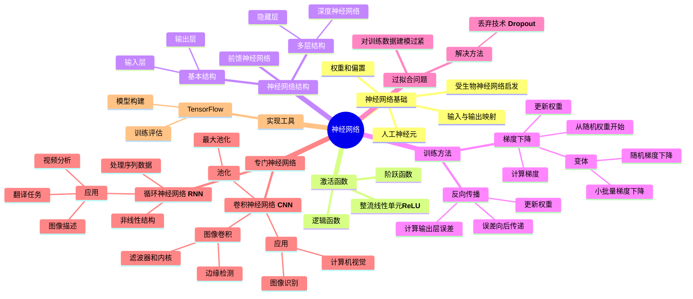

# 神经网络知识总结

神经网络是受生物神经元启发的数学学习模型，通过网络结构和参数将输入映射到输出。

## 主要概念总结

- **神经网络基础**：受生物神经网络启发，由人工神经元(单元)组成，通过权重和偏置处理输入数据
- **激活函数**：决定神经元何时激活，主要包括阶跃函数、逻辑函数和ReLU函数
- **神经网络结构**：包括输入单元、带权重的连接、偏置和输出单元
- **训练方法**：
  - 梯度下降：最小化损失的算法，包括普通梯度下降、随机梯度下降和小批量梯度下降
  - 反向传播：训练隐藏层的算法，从输出误差开始向后计算
- **过拟合问题**：对训练数据建模过于紧密，可通过dropout(随机丢弃单元)技术解决
- **神经网络类型**：
  - 多层神经网络：含隐藏层，能处理非线性数据
  - 卷积神经网络：使用图像卷积和池化处理图像数据
  - 循环神经网络：处理序列数据，输出可作为输入

## 思维导图

这个思维导图展示了神经网络的核心概念和它们之间的关联，从基础原理到不同类型的神经网络及其应用。